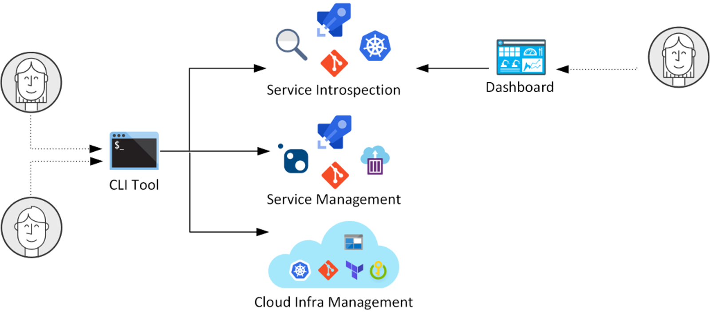

# Bedrock CLI

[](https://dev.azure.com/epicstuff/bedrock/_build/latest?definitionId=2328&branchName=master)


`bedrock` helps you automate, manage, and observe Kubernetes deployment
operations based on [Bedrock](http://aka.ms/bedrock) patterns and principles.

Key features:

1. Builds event triggered GitOps pipelines
   ([learn more](./guides/project-service-management-guide.md))
2. Provides tabular introspection of applications from Docker image build to
   multi-cluster deployment
   ([learn more](./guides/service-introspection-onboarding.md))
3. Streamlines management of versioned Terraform environments
   ([learn more](./guides/infra/README.md#guides))



## Install

You can install `bedrock` via `homebrew` or with the pre-compiled binaries

### Homebrew

Version `v0.6.6` and newer are available via homebrew.

Tap to the formulae repository:

```
$ brew tap microsoft/bedrock
```

Install `bedrock`:

```
$ brew install microsoft/bedrock/bedrock-cli
```

Run `bedrock`

```
$ bedrock
```

### Pre-compile binaries

Download pre-compiled binaries of `bedrock` on the
[releases](https://github.com/microsoft/bedrock-cli/releases) page.

## CLI

```shell
$ bedrock
Usage: bedrock [options] [command]

The missing Bedrock CLI

Options:
  -v, --verbose      Enable verbose logging
  -V, --version      output the version number
  -h, --help         output usage information

Commands:
  init|i [options]   Initialize the bedrock tool for the first time.
  setup|s [options]  An interactive command to setup resources in azure and azure dev-ops
  deployment         Introspect your deployments
  hld                Commands for initalizing and managing a bedrock HLD repository.
  infra              Manage and modify your Bedrock infrastructure.
  project            Initialize and manage your Bedrock project.
  service            Create and manage services for a Bedrock project.
```

## Prerequisites

To use `bedrock`, you must make sure you have the following tools installed:

- `git` - at _least_ version 2.22. Follow download instructions
  [here](https://git-scm.com/downloads)

Follow instructions to download and install the rest of the prerequisites
[here.](https://github.com/microsoft/bedrock/blob/master/tools/prereqs/README.md)

## Getting Started

The fastest way to get started with `bedrock` is to following our interactive
initialization.

```bash
bedrock init -i
```

This will guide you through the process of creating a configuration.
Alternatively if you already have a
[configuration file](./guides/config-file.md) you can run the command:

```bash
bedrock init -f bedrock-config.yaml
```

## Guides

You will find several guides to help you get started on each of the CLI area
[here](./guides/README.md).

- [Managing a project with the CLI](./guides/project-service-management-guide.md)
- [Observing deployments with the CLI](./guides/service-introspection-onboarding.md)
- [Simplifying multiple Terraform environments with the CLI](./guides/infra/README.md#guides)

## CLI Command Reference

> https://microsoft.github.io/bedrock-cli/commands/

## Contributing

[Contributing to bedrock](./guides/contributing.md).
