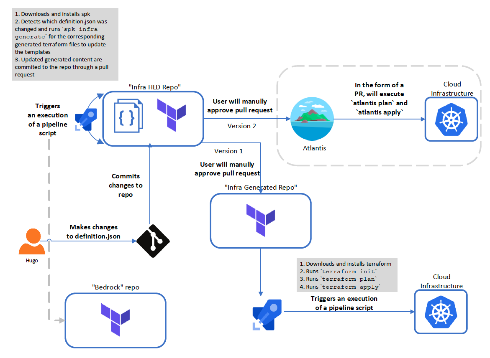

# (Another) SPK Infra Narrative

An extension to
[Bedrock E2E](https://github.com/CatalystCode/bedrock-end-to-end-dx).

Olina's coworker, Hugo, a developer, overheard the exciting project of Bedrock,
and is interested in experiementing with it. Olina, who is now an expert at
Bedrock, decided to write up a "guide" to help Hugo get started with building,
maintaining, and deploying his infrastructure.

# Infrastructure Configuration and Deployment (Day 0-1)

## Building Cluster Definition

Like Olina, Hugo suspects that his project will grow over time, so he wants to
be able to scalably add and manage N clusters without having to manage N sets of
Terraform code and configuration. Huga would like each deployement to resemble
the same Terraform environment template, but use different configuration values.
Luckily, `spk` supports a hierarchical structure, where each layer will inherit
configuratiom from its parent layer (if its not specified at the child level).
To begin, Hugo runs:

`spk infra scaffold --name fabrikam --source https://github.com/microsoft/bedrock --version master --template cluster/environments/azure-single-keyvault`

When he runs this command, he finds that it does the following:

- Creates a directory called `fabrikam`
- Creates a `definition.yaml`.

Hugo proceeds with updating the values of his `definition.yaml` file. He made
sure to update variables that he wants to be shared across all his clusters. His
`definition.yaml` now resembles the following:

```yaml
name: fabrikam
source: "https://github.com/Microsoft/bedrock.git"
template: cluster/environments/azure-single-keyvault
version: master
backend:
  storage_account_name: fabrikam-storage-account
  access_key: secret
  container_name: fabrikam-container
  key: tfstate-key
variables:
  address_space: 10.10.0.0/16
  agent_vm_count: 3
  agent_vm_size: Standard_D2s_v3
  gitops_ssh_url: git@ssh.dev.azure.com:fabrikam/cluster-manifests
  gitops_ssh_key: path/to/private/key
  gitops_path: ""
  keyvault_name: fabrikam-kv
  keyvault_resource_group: fabrikam-kv-rg
  resource_group_name: fabrikam-rg
  service_principal_id: ${env:ARM_CLIENT_ID}
  service_principal_secret: ${env:ARM_CLIENT_SECRET}
  vnet_name: fabrikam-vnet
  subnet_name: fabrikam-subnet
  acr_name: fabrikam-acr
```

Now that Hugo has scaffolded out the globally common configuration, he goes on
to define the first cluster. To do this, he repeats the `spk` scaffolding step.

`spk infra scaffold --name fabrikam/fabrikam-east --source https://github.com/microsoft/bedrock --version master --template cluster/environments/azure-single-keyvault`

Like before, this will create a new directory with a corresponding
`definition.yaml` file. Again, Hugo modifies the `definition.yaml` so that _this
time_, the cluster definition will hold information that is unique to the
cluster, like the following:

```yaml
name: fabrikam
source: "https://github.com/Microsoft/bedrock.git"
template: cluster/environments/azure-single-keyvault
version: master
variables:
  cluster_name: fabrikam-east-cluster
  dns_prefix: fabrikam-east-cluster
  gitops_path: "fabrikam-east"
  resource_group_name: "fabrikam-east-rg"
  subnet_prefixes: "10.7.0.0/16"
```

Hugo repeats the steps for his west and central cluster, and eventually he has
the following hierarchy:

```
fabrikam/
    definition.yaml
    fabrikam-central/
        definition.yaml
    fabrikam-east/
        definition.yaml
    fabrikam-west/
        definition.yaml
```

## Generating Cluster Terraform Templates

Hugo plans on generating the Terraform scripts for all the infrastructure, and
he does this by running:

`spk infra generate -p <cluster>`

against each regional cluster in the `fabrikam` project folder.

After generation, his directories now look something like this:

```
fabrikam/
    definition.yaml
    fabrikam-central/
        definition.yaml
    fabrikam-east/
        definition.yaml
    fabrikam-west/
        definition.yaml
fabrikam-generated/
    fabrikam-central/
        main.tf
        variables.tf
        keyvault.tf
        terraform.tfvars
        backend.tfvars
    fabrikam-east/
        main.tf
        variables.tf
        keyvault.tf
        terraform.tfvars
        backend.tfvars
    fabrikam-west/
        main.tf
        variables.tf
        keyvault.tf
        terraform.tfvars
        backend.tfvars
```

## Deploying Cluster

With the above defined and the Terraform scripts generated, Hugo can leverage
Terraform tools he has installed to deploy (or update) the defined clusters. To
deploy the infrastructure, he first navigates to
fabrikam/fabrikam-central/generated.

```
$ terraform init
$ terraform plan
$ terraform apply
```

and likewise, afterwards in the east and west sub-directories.

# CI/CD: Infrastructure GitOps (Day 2+)

From Olina, Hugo has learned of the headaches from manually updating and
versioning his cluster at scale. So, he attempts to come up with an approach to
automate some of these components.

Hugo creates git repositories to hold all of his infrastructure files: (1)
Cluster HLD repo (contains `definition.yaml` files), and (2) Cluster Generated
repo (contains generated terraform files). He wants to rely on git pull
requests, and triggered Azure DevOps pipelines to automate changes made to his
cluster. To do this, he writes a script for a generation pipeline linked to the
cluster definition repo that will do the following:

- Download and install the latest version of `spk`
- Runs `spk infra generate` on the modified `definition.yaml`
  - Regenerates the terraform templates with the new changes
  - Validates the generated files by executing terraform commands (i.e.
    `terraform init` and `terraform plan`)
- Upon successful terraform execution, commit and push generated terraform files
  to a branch
- Creates a pull request against the master branch of the Cluster Generated repo

He then creates a deployment pipeline using Azure DevOps pipelines linked to the
Cluster Generated repo that will:

- Download and install the latest version of `terraform`
- Runs `terraform init`, `terraform plan`, and `terraform apply` to update his
  Cloud infrastructure.

## Updating a Configuration

Hugo would like to change the `agent_vm_count` for his `fabrikam-east` cluster,
and although he could simply update the `definition.yaml` file, run
`spk infra generate` on the directory, and then finally run `terraform apply` to
update the cluster, he would rather have these changes be automated, versioned,
and logged somewhere. With the approach described above, Hugo can update the
`definition.yaml` file, and push a new commit to the Cluster HLD Repo. From
there, this will trigger an Azure DevOps pipeline that will execute a script.
The script will download and install `spk`, run `spk infra generate` against the
appropriate cluster to generate terraform files. Finally, the pipeline will
execute terraform commands to ensure the terraform files are valid before
creating a git pull request against the Cluster Generated repo. Hugo will need
to review the pull request on the Cluster Generated repo to ensure that the
changes are correct before merging.

When the changes are merged, a deployment pipeline will be triggered to execute
a simple script to perform `terraform` commands (i.e. `terraform apply`). Once
the `terraform` commands succeed, the cluster should be updated!

**NOTE**: This approach only supports Terraform infrastructure that uses a
remote backend.

## Updating a Template

Hugo wants to add a null resource to his `azure-single-keyvault` template. So,
he makes changes to the terraform templates to his personal Terraform template
**source** repo. However, now he wants the `fabrikam-west` cluster to reflect
this change. Similar to updating a configuration, Hugo makes a change to his
`definition.yaml` by running `spk infra scaffold` to regenerate the
`definition.yaml` files with the appropriate (new) variables (or he can simply
modify the existing `definition.yaml`). Then, he commits this change to the
Cluster HLD repo, which will trigger the CI/CD pipelines to accomplish a
successful cluster deployment.



# Summary

- User runs `spk infra scaffold` to generate `definition.yaml` files and build
  hiearchy for multi-cluster.
- User runs `spk infra generate` to generate Terraform scripts based on the
  `definition.yaml` files.
- User creates two git repositories: (1) Infra HLD repo and (2) Infra Generated
  repo. The `definition.yaml` resides in the Infra HLD repo, meanwhile, the
  generated Terraform scripts reside in the Infra Generated repo.
- User configures Azure DevOps pipelines that are triggered off of git commits
  and PRs.
  - The first Azure DevOps pipeline ("Generation Pipeline") will (re)generate
    Terraform files when `definition.yaml` files are updated. (triggered off
    Infra HLD repo)
  - The second Azure DevOps pipeline ("Deployment Pipeline") will execute
    Terraform commands to deploy changes to cluster. (triggered off Generated
    repo)
