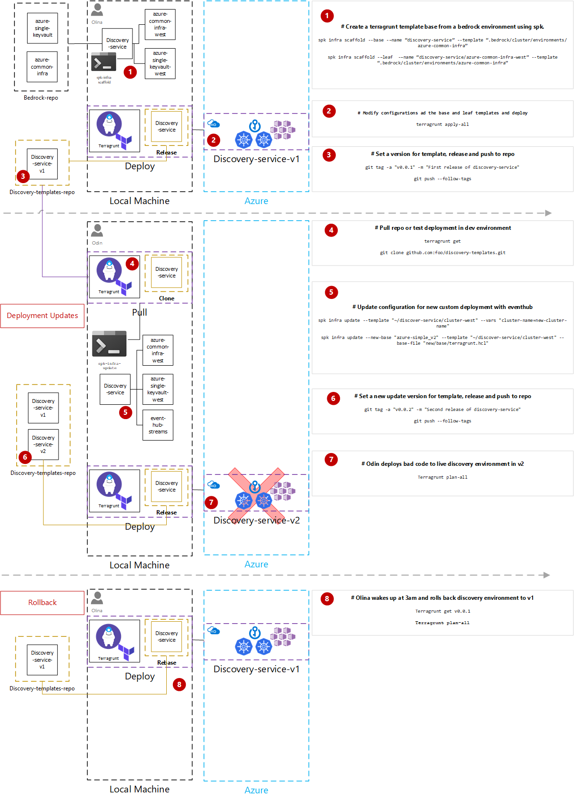

# SPK + Terragrunt Scenarios

## Building Cluster Definition (Alternative)

Olina moves on to create her infrastructure deployment definition. She knows
that in the long term the project will grow beyond just a single cluster to
multiple clusters and wants to be able to scalably add and manage these clusters
without having to hand manage N sets of nearly identical Terraform code and
config. Instead, she would like to exploit the fact that each deployment will be
nearly exactly the same in structure but differ in a few configuration values
(region, connection strings, etc). `spk` allows her to do this with hierarchical
deployment definitions, where each layer inherits from the layer above it. Given
this, she starts by creating a common definition based on an existing template:

```bash
$ spk infra scaffold --base --name discovery-cluster --source https://github.com/fabrikam/bedrock --template cluster/environments/fabrikam-single-keyvault
```

This creates a directory called discovery-cluster and places a terragrunt.hcl
file with a locked version (such that it does not change underneath the
infrastructure team without them opting into a change) that is a tag in the git
repo and a block for setting variables that are globally the same for the
discovery-cluster and a Terraform template called fabrikam-single-keyvault that
contains all of their common infrastructure items.

```tf
inputs = {
    vnet_name = ""
    subnet_name = ""
    subnet_prefix = ""
    address_space = ""
    keyvault_name = ""
    service_principal_id = ""
    tenant_id = ""
    subnet_prefixes = ""
    agent_vm_count: ""
    gitops_ssh_url: ""

    tag = {
      source = "https://github.com/fabrikam/bedrock"
      template = "cluster/environments/fabrikam-common-infra"
      commit = "985b755a8fcc89d0fe412c8f4c1cc9ab419124d2"
    }
}

remote_state {
}
```

Since they want all of their clusters to be of the same size globally, Olina
edits the variable block to include the number of node VMs and common location
for the GitOps repo for each of those clusters that she gets from Dag. She also
adds the remote backend arguments to store terraform states.

```tf
inputs = {
    vnet_name = "spkvnet"
    subnet_name = "spksubnet"
    subnet_prefix = "10.39.0.0/24"
    address_space = "10.39.0.0/16"
    keyvault_name = "spkkeyvault"
    service_principal_id = "${get_env("AZURE_CLIENT_ID", "")}"
    tenant_id = "${get_env("AZURE_TENANT_ID", "")}"
    keyvault_resource_group = "nr-spk-infra-tests-rg"
    subnet_prefixes = "10.39.0.0/16"
    agent_vm_count = "16"
    gitops_ssh_url = "git@github.com:fabrikam/discovery-cluster-manifests.git"

    tag = {
      source = "https://github.com/fabrikam/bedrock"
      template = "cluster/environments/fabrikam-common-infra"
      commit = "985b755a8fcc89d0fe412c8f4c1cc9ab419124d2"
    }
}

remote_state {
    #disable_init = true
    backend = "azurerm"
    config = {
        resource_group_name  = "${get_env("AZURE_BACKEND_RG_NAME", "")}"
        storage_account_name = "${get_env("AZURE_BACKEND_STORAGE_NAME", "")}"
        container_name       = "${get_env("AZURE_BACKEND_CONTAINER_NAME", "")}"
        access_key           = "${get_env("AZURE_BACKEND_ACCESS_KEY", "")}"
        key                  = "spk1.${path_relative_to_include()}/terraform.tfstate"
    }
}
```

Now that Olina has scaffolded out the globally common configuration for the
`discovery-cluster`, she wants to define the first cluster that Fabrikam is
deploying in the east region. To do that, she enters the `discovery-cluster`
directory above and issues the command:

```bash
$ spk infra --leaf scaffold --name east
```

Like the previous command, this creates a directory called `east` and creates a
`terragrunthcl.` file in it with the following:

```tf
{
  inputs = {
    tag = {
      source = "https://github.com/fabrikam/bedrock"
      template = "cluster/environments/fabrikam-common-infra"
      commit = "985b755a8fcc89d0fe412c8f4c1cc9ab419124d2"
    }
  }
  include {
    path = find_in_parent_folders()
}
  terraform {
      source = "../"
    }
}
```

She then fills in the east specific variables for this cluster:

```tf
{
  inputs = {
    cluster_name = "discovery-cluster-east",
    gitops_path = "east"
    resource_group_name = "discovery-cluster-east-rg",
    vnet_name = "discovery-cluster-east-vnet",

    tag = {
      source = "https://github.com/fabrikam/bedrock"
      template = "cluster/environments/fabrikam-common-infra"
      commit = "985b755a8fcc89d0fe412c8f4c1cc9ab419124d2"
    }
  }
}
```

Likewise, she wants to create a `west` cluster, which she does in the same
manner from the `discovery-cluster` directory:

```bash
$ spk infra scaffold --leaf --name west
```

And fills in the `terragrunt.hcl` file with the following `west` specific
variables:

```tf
{
  inputs = {
    cluster_name = "discovery-cluster-west",
    gitops_path = "west"
    resource_group_name = "discovery-cluster-west-rg",
    vnet_name = "discovery-cluster-west-vnet",

    tag = {
      source = "https://github.com/fabrikam/bedrock"
      template = "cluster/environments/fabrikam-common-infra"
      commit = "985b755a8fcc89d0fe412c8f4c1cc9ab419124d2"
    }
  }
}
```

With this, she now has a directory structure resembling:

```
└── discovery-service/
  ├── terragrunt.hcl
  ├── main.tf
  ├── terragrunt.hcl
  ├── variables.tf
  ├── west/ (deployment)
  │   └── terragrunt.hcl
  └── east/ (deployment)
      └── terragrunt.hcl
```

## Generating Deployable Cluster Terraform Scripts

With Olina's cluster infrastructure now defined, she can now generate a
deployment plan for all the infrastructure in this deployment by navigating to
the `discovery-cluster` top level directory and running:

```bash
$ terragrunt plan-all
```

This command recursively reads in the configuration at the current directory
level, applies the `terragrunt.hcl` there to the currently running dictionary
for the directory scope, and descends 1 level of the path step by step. At the
leaf directory, it creates a `terragrunt-cache` directory and fills the
Terraform definition using the base template with the accumulated variables.

With this, `terragrunt` has validated the configured directories like this with
user approval pending for deployment.

## Committing Cluster Definitions

These cluster definitions are designed to be committed to source control such
that the operations team can version control them, understand and retrieve the
current state of the system at any time, and potentially integrate them into a
devops process utilizing something like Atlantis to deploy the generated
templates. As such, they should be regarded as repos that store config, but not
secrets, and secrets should be externalized out to a secret secret store or
environment variables that are applied just in time.

## Updating Template Version & Rolling back

### Updating

After several weeks, Odin joins the `discovery-cluster` project and upon the
request of his lead Olina, He wishes to test out streaming functionality with
the clusters in `east` and `west`.



Odin installs terragrunt on his machine and wishes to test the current
deployment of discovery-service in a dev environment. Odin, uses a
`terragrunt.hcl` to pull the latest tagged version for him to test.

```tf
{
  source = "git@github.com:microsoft/bedrock.git//cluster/environments/azure-simple?v0.0.2"
}

```

This is cached into a sub folder for Odin to deploy in his own dev environment.
Next he wishes to update the west template to include an eventhub he is testing
for streaming. He runs a
`spk infra update --hcl "/new-configs/terragrunt.hcl" --template discovery-service/west`.
This replaces the config file at this leaf. He also adds the eventhub terraform
module since this resource is unique to discovery-service/west.

Odin is now ready to cut a new release of the infrastructure deployments and he
can do this by using git & CI/CD.

```
git tag -a "v0.0.3" -m "second release of discovery + eventhub in west"
git push --follow-tags
```

### Rollback

Olina receives an alert at 3am stating the west cluster is down. Olina pulls the
latest from the discovery-service repository and notices the new release. To
remediate the cluster down as soon as possible, she applys the previous release
of the discovery-service to the CI/CD live stage.

## `spk infra scaffold`

### SPK & Template Versioning (Work in progress)

Spektate will version infrastructure templates based on modification of base HCL
files and their respective leaf templates. Since the base is now top down
propagated for deployment, only the bases need to have a version of their
derived template.

```
inputs = {
    cluster_name             = "spk-cluster-west"
    ssh_public_key           = "public-key"
    gitops_ssh_url           = "git@github.com:timfpark/fabrikate-cloud-native-manifests.git"
    gitops_ssh_key           = "<path to private gitops repo key>"

    tag = {
      source = "https://github.com/fabrikam/bedrock"
      template = "cluster/environments/fabrikam-common-infra"
      commit = "985b755a8fcc89d0fe412c8f4c1cc9ab419124d2"
    }
}
```

Additional Thoughts:

- Investigation of mapping config template to `tfstate` file (Terraform
  Workspaces)
- Also provide guidance for alternatively using gitops through Atlantis for
  versioning.

## `spk infra update`

## SPK & Template Updating - Targeted Day 2 Scenarios

#### **Update Infrastructure Config & Modifications**

- **Update Infrastructure Config & Modifications** - Using `spk infra update` to
  modify Terragrunt HCL files based on args in a provided template folder (Leaf
  Deployments). `spk infra update` should be provided an argument (e.g.
  --template hcl-file / or var) that will pass the path to the leaf deployment
  definition to either update the hcl file or a var within the hcl file.

> `spk infra update --template "~/discover-service/cluster-west" --vars "cluster-name=new-cluster-name"`

Expected Day 2 Operations Coverage:

- Node count update
- Node type
- VM OS upgrades (Without Upgrade Paths)
- Kubernetes Upgrades (Without Upgrade Paths)

#### **Update Partial Leaf Deployments / Migrating Base**

- **Update Partial Leaf Deployments / Migrating Base** - Using
  `spk infra update` to create a new base for a subset of leafs to be migrated
  to a new common configuration for deployment.

> Example:
> `spk infra update --new-base "azure-simple_v2" --template "~/discover-service/cluster-west" --base-file "new/base/terragrunt.hcl"`

```
└── recursive
    └── azure-simple (base)
        ├── README.md
        ├── terragrunt.hcl
        ├── azure-simple-east (deployment)
        │    ├── main.tf
        │    ├── terragrunt.hcl
        │    └── variables.tf
        └── azure-simple-west (deployment)
             ├── main.tf
             ├── terragrunt.hcl
             └── variables.tf
```

Transfer update

```
└── recursive
    ├── azure-simple (base)
    │   ├── README.md
    │   ├── terragrunt.hcl
    │   ├── azure-simple-east (deployment)
    │   │    ├── main.tf
    │   │    ├── terragrunt.hcl
    │   │    └── variables.tf
    │   └── azure-simple-west (deployment)
    │        ├── main.tf
    │        ├── terragrunt.hcl
    │        └── variables.tf
    └── azure-simple_v2 (base)
        ├── README.md
        ├── terragrunt.hcl
        ├── azure-simple-east_v2 (deployment)
        │    ├── main.tf
        │    ├── terragrunt.hcl
        │    └── variables.tf
```

Expected Day 2 Operations Coverage:

- VM OS upgrades (With Upgrade Paths)
- Kubernetes Upgrades (With Upgrade Paths)

#### **Versioning Template Upgrade** _| In progress_

- **Versioning** - Bedrock Azure simple template has 5 new input vars. I have 15
  cluster derived from azure-simple. How do I upgrade all to generate the new
  vars in my discovery-service.

> Example:
> `spk infra update --template "~/discover-service/cluster-west" --version "0.1.2"`

Additional Thoughts:

- Also provide guidance for alternatively using gitops through Atlantis for
  versioning.

### Guard Rails

Additional Thoughts:

- Terragrunt coupled to terraform version restriction
- One level terragrunt config propagation
- `.spk` Management of templates
- Mock config guidance
- Terraform workspaces on multiple deployment configuration

## Holder for comparison between Terragrunt & Bespoke


