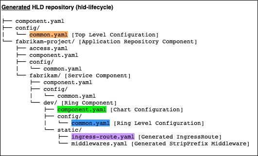
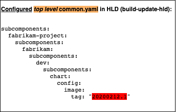

# Building Helm Charts for SPK and Bedrock

### Prerequsities

- This guide assumes that you are familiar with understanding and creating
  [helm charts](https://helm.sh) - which are consumed by
  [fabrikate](https://github.com/microsoft/fabrikate) and `spk`.

- It also assumes that you have set up your `spk` project, and installed all
  necessary pipelines created via `spk project init` (the lifecycle pipeline),
  `spk service create` (build update hld pipeline), and `spk hld init` (manifest
  generation pipeline).

- A helm chart with values.yaml containing
  [mandatory values](#mandatory-helm-chart-configuration).

### Introduction

Recall the three git repositories that exist, and the pipelines that exist
between them:


In this guide, we assume a single application repository with a single service,
a high level definition repository, and a materialized manifest repository, and
all relevant pipelines between.

When building applications that deploy with `spk` pipelines, it is important to
consider the structure of the helm chart that is ultimately rendered to
Kubernetes manifests, and applied to your Kubernetes cluster. For this guide,
refer to the following `bedrock.yaml` file at the root of an application source
repository, and the packaged [sample helm chart](./sample-helm-chart) that
allows `spk` created pipelines to operationalize building, updating, and
deploying container images to your cluster.

```yaml
rings:
  dev:
    isDefault: true
services:
  ./:
    displayName: "fabrikam"
    helm:
      chart:
        branch: master
        git: "https://dev.azure.com/fabrikam/frontend/_git/charts"
        path: frontend
    k8sBackend: "fabrikam-k8s-svc"
    k8sBackendPort: 80
    middlewares: []
    pathPrefix: "fabrikam-service"
    pathPrefixMajorVersion: "v1"
variableGroups:
  - fabrikam-vg
```

The above service `fabrikam` was added to `bedrock.yaml` by invoking
`spk service create` with the requisite parameters ie:

```sh
spk service create . \
--display-name fabrikam \
--helm-config-git https://dev.azure.com/fabrikam/frontend/_git/charts \
--helm-config-path frontend \
--helm-config-branch master \
--k8s-backend fabrikam-k8s-svc \
--k8s-backend-port 80 \
--path-prefix fabrikam-service \
--path-prefix-major-version v1
```

When the above `bedrock.yaml` is committed and pushed to its git repository, the
`hld-lifecycle` pipeline (which is generated and installed by `spk project init`
and `spk project install-lifecycle-pipeline`) will consume the `bedrock.yaml`
file and produce an initial HLD (a fabrikate consumable – see
[this document](https://github.com/microsoft/fabrikate/blob/master/docs/component.md)
for more details regarding its structure) that represents the structure to be
consumed consumed by Fabrikate and rendered to Kubernetes manifests.

### Breaking down a HLD

#### Generated HLD

A HLD is generated from the `hld-lifecycle` pipeline, from any changes that are
made to `bedrock.yaml`. This HLD will be a tree structure of directories and
files, resembling the following:



Note the highlighted files: the top level `common.yaml` (orange), the chart
level `component.yaml` (green), the ring level `common.yaml` (blue), and the
`ingress-route.yaml` for traefik2 (purple). The `hld-lifecycle`, after
scaffolding these files, will create a git pull request against the `master`
branch on Azure DevOps with these files added. When merged into `master`, the
`manifest-generation` [pipeline](#manifest-generation-pipeline) is kicked off.

We will explore the contents of each of these files individually, starting with
the top level `common.yaml`.

#### Top level configuration



This file represents the "entry point" in configuring a running container image.
This configuration is ever changing - every new git merge to the `dev` branch of
the application source repository will trigger the `build-update-hld` pipeline
for the `fabrikam` service which will build a new container image, and tag it
with a build id tag, and set the image ID on the HLD at this `common.yaml` file.

The highlighted line in red is the tag of the container image that has been
configured for the service `fabrikam` for ring `dev`. Later (in the
`manifest-generation` pipeline), this configuration is applied onto the Helm
chart configured in `component.yaml`, discussed below.

#### Chart level configuration


The `hld-lifecycle` pipeline scaffolds the above component.yaml with two
subcomponents. The first subcomponent, simply called `chart` references a helm
chart and has the same configuration a user provides to `spk service create`,
which is written to `bedrock.yaml`. The relevant lines from `bedrock.yaml` are
below:

```yaml
helm:
  chart:
    branch: master
    git: "https://dev.azure.com/fabrikam/frontend/_git/charts"
    path: frontend
```

The above configuration presumes that you have a _seperate_ git repository that
contains a helm chart in the `frontend` path. This helm chart is further
configured by a scaffolded configuration from the `hld-lifecycle` pipeline. For
reference, a "compatible" helm chart for `spk` is
[provided here](./sample-helm-chart).

#### Ring level configuration


The above `common.yaml` configures the subcomponent `chart` from the
`component.yaml` above to configure a `serviceName` for the helm chart,
`fabrikam-k8s-svc-dev`. This configuration is produced from the `hld-lifecycle`
pipeline, and consumes configuration a user provides via `spk service create`,
which is written to `bedrock.yaml`. The relevant lines consumed from
`bedrock.yaml` are below:

```yaml
rings:
  dev:
    isDefault: true
services:
  ./
    ...
    k8sBackend: 'fabrikam-k8s-svc'
```

The `serviceName` is generated from a combination of the `k8sBackend`,
`fabrikam-k8s-svc`, and the ring name, in this case `dev`.

#### Static configuration

The second subcomponent in the `component.yaml` above references a subdirectory
at the same level, named `static`. This subdirectory contains a generated
Traefik IngressRoute from the `hld-lifecycle` pipeline, which is a static
Kubernetes manifest and can be directly applied to a cluster.


The `hld-lifecycle` pipeline scaffolds the above
[Traefik2 IngressRoute](https://docs.traefik.io/v2.0/providers/kubernetes-crd/)
from configuration a user provides via `spk service create`, which is writen to
`bedrock.yaml`. The relevant lines consumed from `bedrock.yaml` are below:

```yaml
rings:
  dev:
    isDefault: true
services:
  ./
    ...
    displayName: 'fabrikam'
    k8sBackend: 'fabrikam-k8s-svc'
    pathPrefix: 'fabrikam-service'
    pathPrefixMajorVersion: 'v1'
```

- The name of the IngressRoute, `fabrikam-dev` is generated from a combination
  of the displayName and the ring name (in this case, `dev`).

- The match rule, `PathPrefix('/v1/fabrikam-service') && Headers('Ring', 'dev')`
  is generated from a combination of the `pathPrefixMajorVersion`, the
  `pathPrefix` and the ring name (once again `dev`).

- The backing service `fabrikam-k8s-svc-dev`, (highlighted in green) is
  generated from `k8sBackend` and the ring name (`dev`).

#### Mandatory Helm Chart Configuration

Take a look at the [packaged reference helm chart](./sample-helm-chart), it
contains a `values.yaml`, which is a set of default values for helm charts:

```yaml
image:
  tag: stable
  repository: ""

serviceName: "service"
```

This set of values is the _required_ set of values for `spk` created pipelines
to operationalize building, updating, and deploying container images to your
cluster.

`image.tag`: This configuration is overriden by the values from the
[top-level configuration](#top-level-configuration)

`serviceName`: This configuration is overriden by the values form the
[ring-level-configuration](#ring-level-configuration) file

`image.repository`: This configuration is a special configuration, that can
_only_ configured by a pipeline variable, `ACR_NAME`. `ACR_NAME` must be
configured to be strictly the name of the Azure Container Registry, _not_ it's
fully qualified url ie. `fabrikam` instead of `fabrikam.azurecr.io`.

### Manifest generation pipeline

The manifest generation pipeline is created by:

1. Invoking `spk hld init`
2. Committing and pushing the outputted artifacts
3. Installing the generated pipelines yaml file by invoking
   `spk hld install-manifest-pipeline` in a HLD repository.

This pipeline will be triggered off _any_ changes to the `master` branch of the
HLD repository, rendering the HLD to static Kubernetes manifests that are
consumed by a cluster.

From the `bedrock.yaml` referenced in the [introduction](#introduction), and the
[generated HLD](#generated-hld), along with the outputted configuration from the
[top-level configuration](#top-level-configuration) and the
[ring-level-configuration](#ring-level-configuration) files, a helm chart is
rendered to static Kubernetes manifests and pushed to a manifest repository.

We expect two manifests to be rendered, which are discussed below

#### Kubernetes Service


This is simply a
[Kubernetes Service](https://kubernetes.io/docs/concepts/services-networking/service/)
that contains two pieces of rendered metadata, both propagated to the `Service`
from [ring level configuration](#ring-level-configuration) originally generated
from the `hld-lifecycle` pipeline. The `selector` in this `service` targets a
Kubernetes `Deployment` that maintains the same label.

#### Kubernetes Deployment


This is simply a
[Kubernetes Deployment](https://kubernetes.io/docs/concepts/workloads/controllers/deployment/)
that contains two pieces of rendered metadata, with the `name` and the label
`selector` propagated to the `Deployment` from
[ring level configuration](#ring-level-configuration), and the container image
tag propagated to the `Deployment` from the image tag set in
[top-level-configuration](#top-level-configuration).
