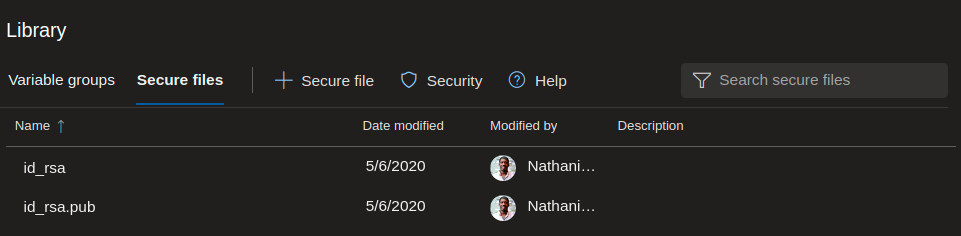
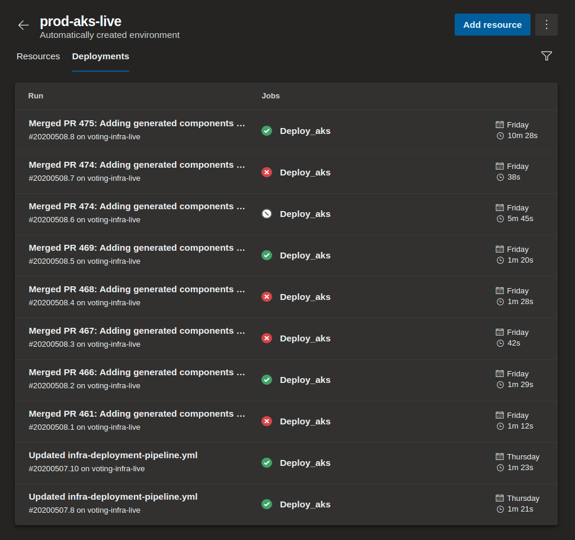
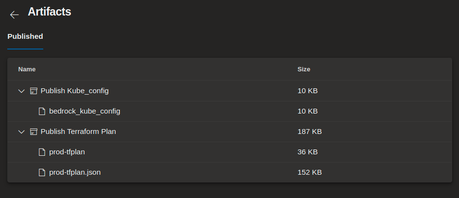

# Guide: Infrastructure Deployment Pipeline

Before reading this guide, it is recommended to visit the guide on deploying an
[Infra Generation Pipeline](./bedrock-infra-generation-pipeline.md).

This section will cover approaches for deploying your infrastructure, which
captures the process for applying changes to your existing Terraform
infrastructure. This guide will not go into detail about implementing each of
the approaches, but instead will suggest different methods for deploying your
infrastructure when already using `bedrock` to manage infrastructure.

## Approaches

### Manual Deployment

With the ability to manage and execute `bedrock infra` commands locally, it is
often more secure to be running `terraform apply` to create or update production
infrastructure manually. This means that you can still rely on `bedrock infra`
to scaffold and generate your terraform projects, but any terraform operations
will be handled manually.

If you make changes to any `definition.yaml` files in your project hierarchy,
and want to push those changes to an existing infrastructure, this will require
you to re-generate the terraform scripts by running `bedrock infra generate` on
the targeted project folder (i.e. `east`), and from there, you can execute
`terraform apply` on the regenerated terraform files to update individual
clusters.

### Deployment Pipeline using Azure DevOps

Some may find automating terraform executions in a pipeline to be a more
favorable approach for infrastructure deployment. This approach will require
prerequisite actions to occur beforehand:

1. Access to an Azure DevOps account with permissions to create repos, and
   pipelines
2. A pipeline script, which at the minimum, will perform the following:
   - Triggered from commits made to the master branch of a Generated repo
   - Download and install Terraform
   - Run `terraform apply` on terraform scripts

## Sample Infrastructure Deployment Pipeline

A template for the deployment of terraform managed infrastructure for Azure
DevOps using the `bedrock CLI` has been provided in the
[`infra-deployment-pipeline.yml`](../../azure-pipelines/templates/infra-deployment-pipeline.yml).
This is a modest base approach to get you started with maintaining persisted
terraform infrastructure using gitops in Azure DevOps. Use the provided template
to deploy stateful resources to using gitops and promote the terraform changes
through your pipeline environments.

### Manage Secure Files

Azure Pipelines Secure Files store files such as signing certificates, binaries,
executables, and SSH keys on the server without having to commit them to your
source repository. Store important files required for accessing your AKS cluster
or services deployed. In the `infra-deployment-pipeline.yml`, it accesses the
private SSH key for node access to an AKS cluster.

### Azure DevOps Environments

Resources are deployed into pipeline environments allowing traceability of
commits and work items. Run details or deployments and application desired state
are captured in environments. At this time resource monitoring is only supported
for AKS and Virtual Machines.

> From YAML, you can target the environment or a specific resource. When you
> create an environment from YAML dynamically, since there are no resources you
> can only refer to environment. If the resources are added to the environment
> then you can target the the specific resource from YAML deployment job with
> environment: `<environment name>`,`<resource name>`.

### Publishing Pipeline Artifacts

Pipeline artifacts are published to associate a terraform plan output with a
commit hash that has modified the deployed environments. Use the artifacts to
revert back to previous versions of the environment once the state has failed.
In the deployment template, the pipeline publishes the `KUBECONFIG` and
terraform plan output.

