# Guide: Infrastructure Generation Pipeline

This section describes how to configure Azure Devops to be your CI/CD
orchestrator for your Infrastructure Generation workflow using `bedrock infra`.

## Prerequisites

1. _Permissions_: The ability to create Projects in your Azure DevOps
   Organization and set security permissions to "Contribute" and "Contribute to
   Pull Requests" for git repositories.
2. _High Level Definitions_: Your own infrastructure high level definitions for
   your deployment. You can refer to a sample repo
   [here](https://github.com/yradsmikham/bedrock-infra-hld). You should be able
   to create your Infra HLD repo using a scaffolding process via `bedrock` (i.e.
   `bedrock infra scaffold`). For more information on how to do that, please
   refer to the [Cloud Infra Management](../cloud-infra-management.md) doc.

## Setup

### 1. Create Repositories and Personal Access Tokens (PATs)

Create both an infrastructure high level definition (HLD) and infrastructure
generated repos. You will also need to create personal access tokens that you
can use for the Infra CI/CD pipeline. We have instructions for how to do that in
two flavors:

- [Azure DevOps](https://github.com/microsoft/bedrock/blob/master/gitops/azure-devops/ADORepos.md)
- [GitHub](https://github.com/microsoft/bedrock/blob/master/gitops/azure-devops/GitHubRepos.md)

**Note**: If your git repos are in different Azure DevOps organizations and/or
pojects, be sure that the generated git repo has "Contribute" and "Contribute to
Pull Requests" permissions configured in the security settings.

### 2. Add Azure Pipeline Build YAML

The Bedrock repository has a
[template](../../azure-pipelines/templates/infra-generation-pipeline.yml) Azure
DevOps pipeline that you may use as reference. Add the
`infra-generation-pipeline.yml` file to the root of the Infra HLD repo.

### 3. Create Pipeline

We use
[Azure Pipelines](https://docs.microsoft.com/en-us/azure/devops/pipelines/get-started/key-pipelines-concepts?toc=/azure/devops/pipelines/toc.json&bc=/azure/devops/boards/pipelines/breadcrumb/toc.json&view=azure-devops)
to generate Terraform files based on your infrastructure high level description
yaml files (e.g. definition.yaml).

In Azure DevOps:

#### 3.1a. Create a Variable Group.

Variable Groups may vary based on the `azure-pipelines.yml` used, but for the
bedrock `infra-generation-pipeline.yml` template, the following variables will
need to be added as part of the pipeline Variable Group:

```
ACCESS_TOKEN_SECRET: Personal Access Token for your repo type.
ARM_CLIENT_ID: Azure Service Principal App ID
ARM_CLIENT_SECRET: Azure Service Principal password
ARM_SUBSCRIPTION_ID: Azure Subscription ID
ARM_TENANT_ID: Azure Service Principal Tenant ID
CLUSTER: A specific cluster name of a multi-cluster (i.e. west)
GENERATED_REPO: The full URL to your manifest repo (i.e. https://github.com/yradsmikham/bedrock-infra-generated.git)
PROJECT_DIRECTORY: The name of your project (i.e. discovery-service)
```

If using Azure DevOps repos, be sure to include the additional environment
variables:

```
AZDO_ORG_NAME: Azure DevOps organization url where the generated repo is hosted (i.e. https://dev.azure.com/org_name/)
AZDO_PROJECT_NAME: The name of the project in your Azure DevOps organization where the generated repo is hosted
```

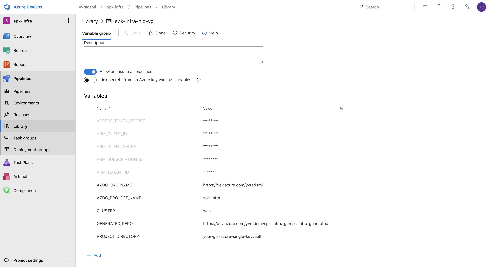

#### 3.1b. Create a Variable Group using Azure Key Vault

Once the Keyvault has been created, You can now create a variable group manifest
similar to the following:

You can create a variable group through the Azure DevOps UI and connect it to
the pre-existing Key Vault you created. Navigate to your pipeline library and
create a new variable group. Identify the key vault that was previously
provisioned.

> Please note that Key Vault Secret names can only contain alphanumeric
> characters and dashes.

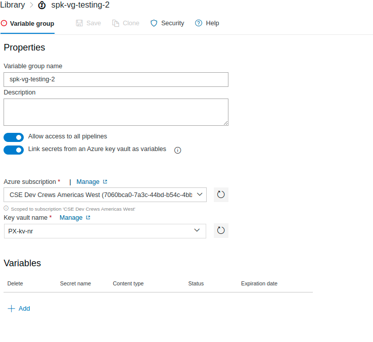

Additionally, be sure to select the respective key secrets you wish to map to
your variable group. Only the secret _names_ are mapped to the variable group,
not the secret values. The latest version of the value of each secret is fetched
from the vault and used in the pipeline linked to the variable group during the
run.

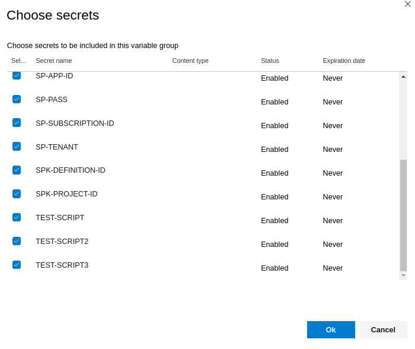

A template generation pipeline that uses a variable group backed by key vault is
provided in the
[infra-generation-pipeline.yml](../../azure-pipelines/templates/infra-generation-kv-pipeline.yml)

> When using a variable group with key vault, you may be prompted to grant
> access permission to all pipelines in order for your newly created pipeline to
> have access to an agent pool and specific service connections in AzDO. Be sure
> to navigate to the Pipeline UI to permit permissions to use the agent pool and
> the service connection to authenticate against your key vault.

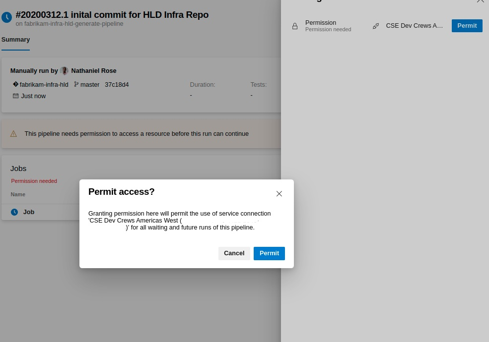

#### 3.2. Create a new pipeline.

You can use the Azure CLI to create the Generation pipeline. To do that, you
will need to do the following:

- Create a service endpoint for the git repository (if you do not already have
  one). This is **only required** for Github repos:

`az devops service-endpoint github create --github-url <github-url> --name <name> --org <azure-devops-org-name> --project <azure-devops-project-name>`

- Then, create the Azure DevOps pipeline for Infra Generation:

`az pipelines create --name <pipeline-name> --branch <repo-branch> --org <org-url> --project <project-name> --repository <git-repo-url> --yaml-path ./azure-pipellines.yml --service-connection <service-connection-id>`

**Note**: The `--service-connection` argument is only required for GitHub repos.
It can be omitted when using Azure DevOps repos.

Additionally, you can also use the Azure DevOps portal to manually create the
pipeline as shown in the following steps 3-7:

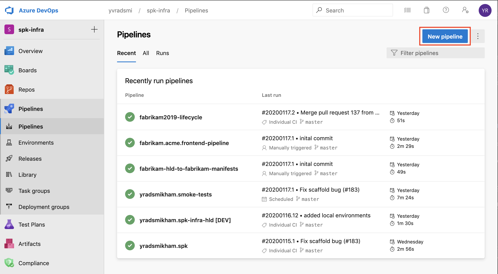

3. Choose the platform you are using for source control. For now, there are only
   examples for GitHub and Azure DevOps repos. However, other version control
   tools should be fairly similar.

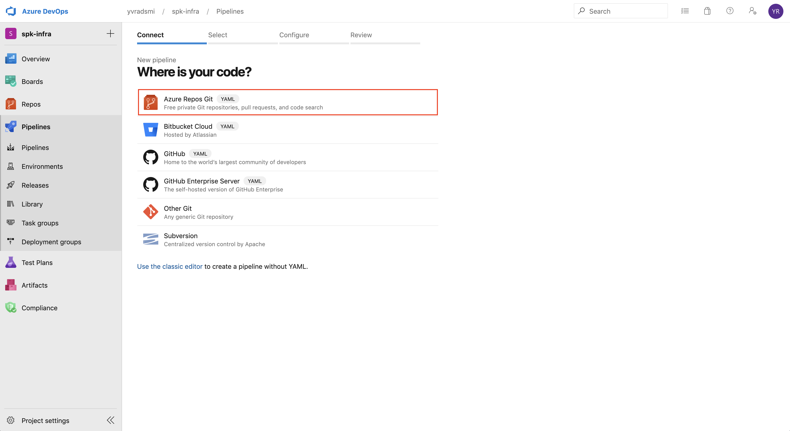

4. Select an Infra HLD repository.

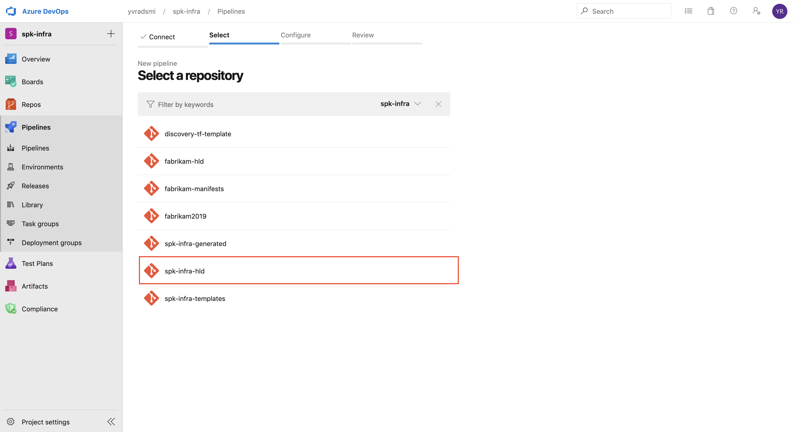

5. Choose "Existing Azure Pipeline YAML file" if there is an
   `azure-pipelines.yml` in the selected Infra HLD repo.

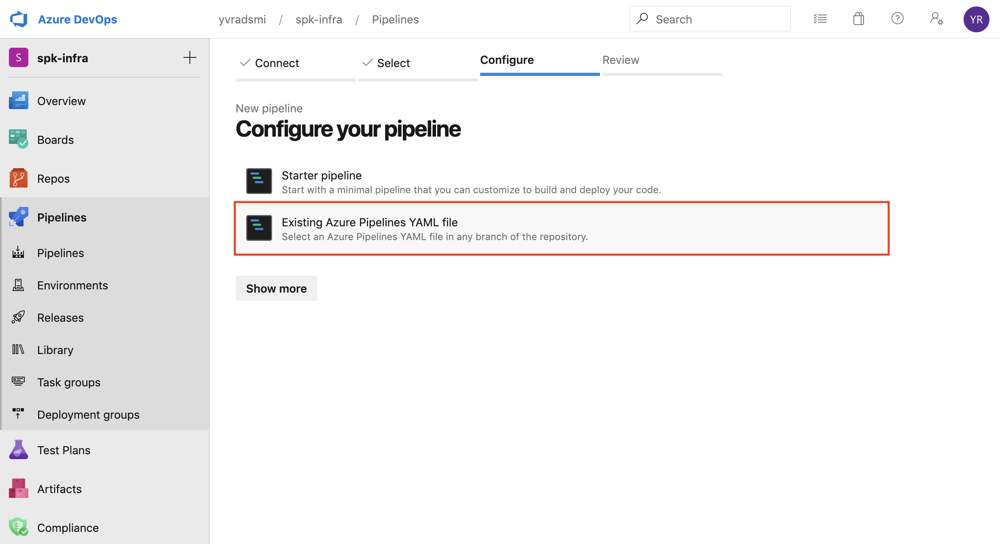

6. On the side panel, select the appropriate repo branch to work from, and also
   the path to the `azure-pipelines.yml` file.

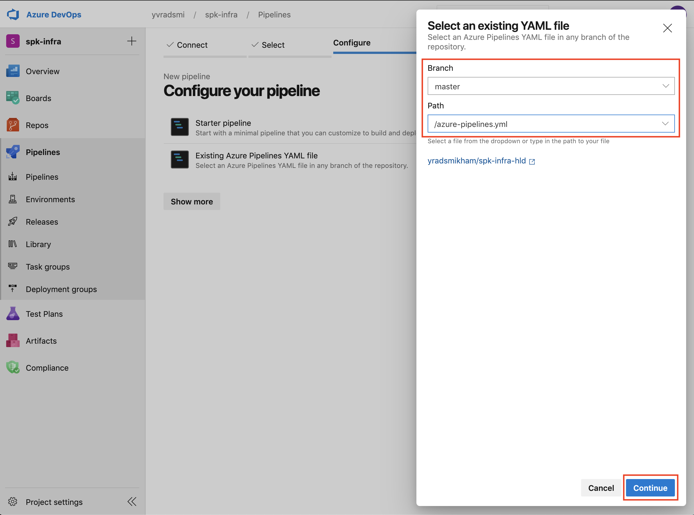

7. Be sure to verify that the `azure-pipelines.yml` is linked to the correct
   variable group that was created earlier. When the pipeline is ready, hit
   'Save and run'

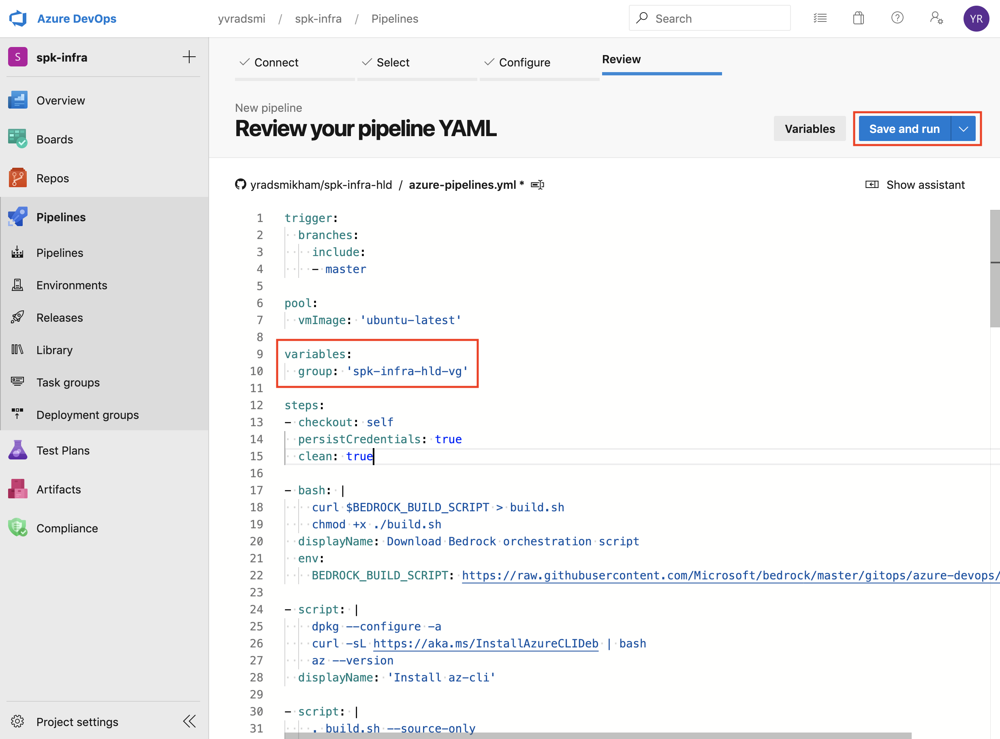

8. Create Pull Request

Assuming your pipeline runs to success...

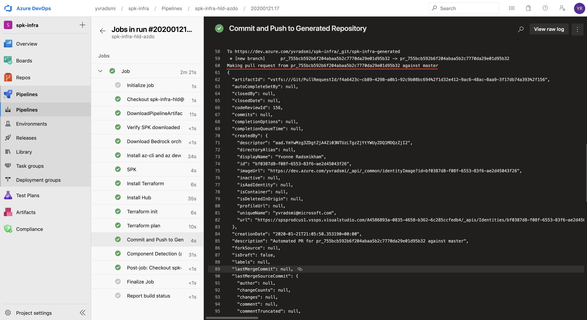

There should now be a PR pending approval for your Infra Generated Repo.

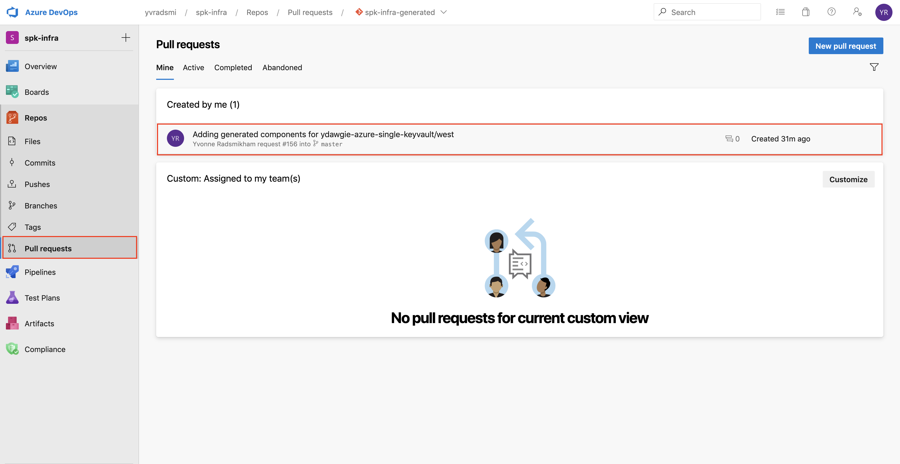

9. Approve and merge PR

If the PR looks correct, hit 'Approve' and then 'Complete'.
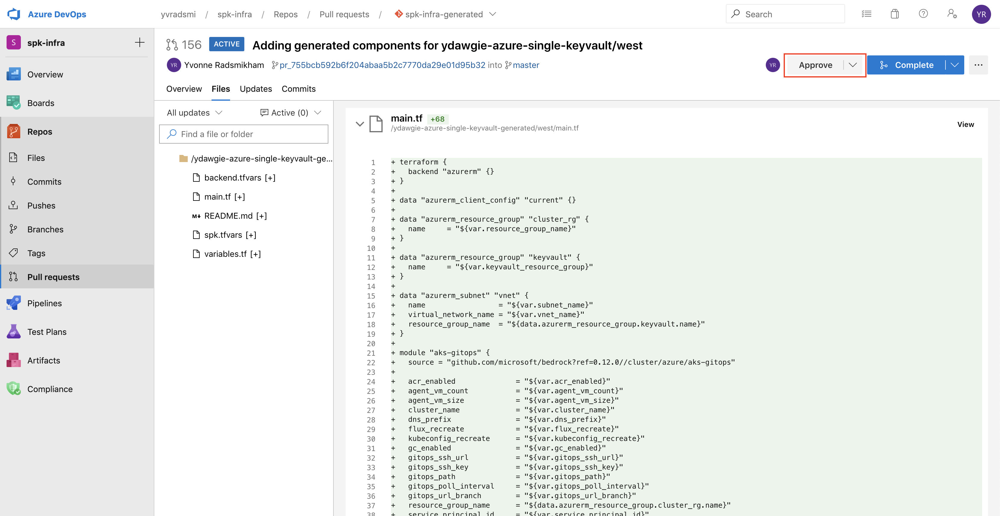

From here, you can complete the merge to master branch of the Infra Generated
Repo.

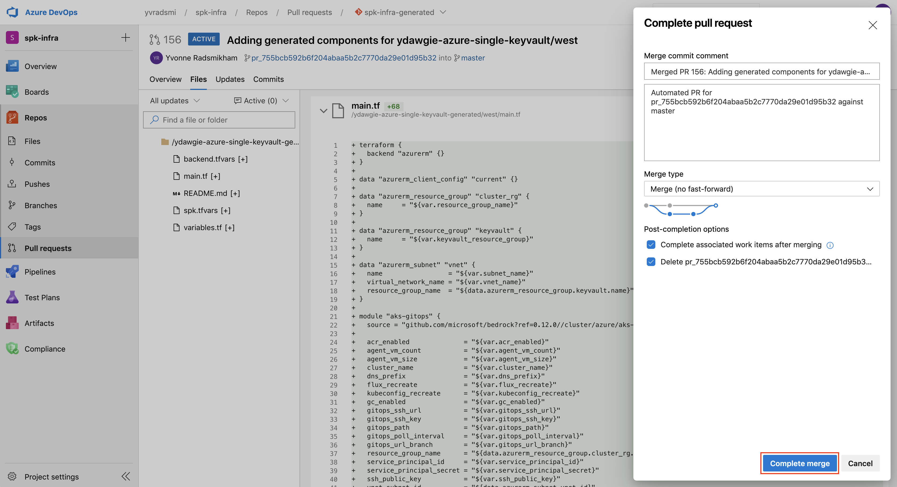
