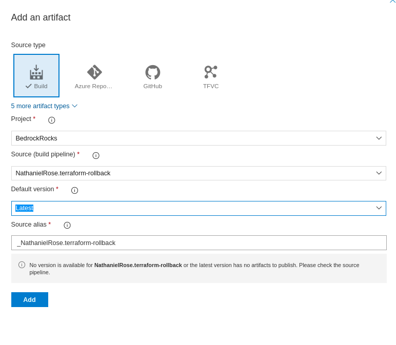
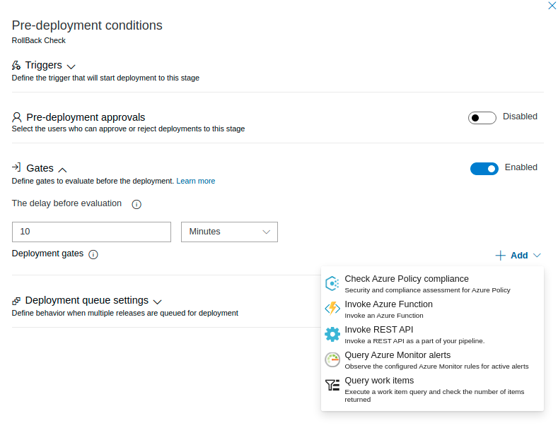
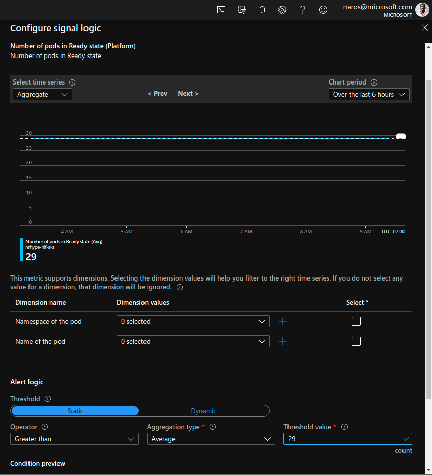
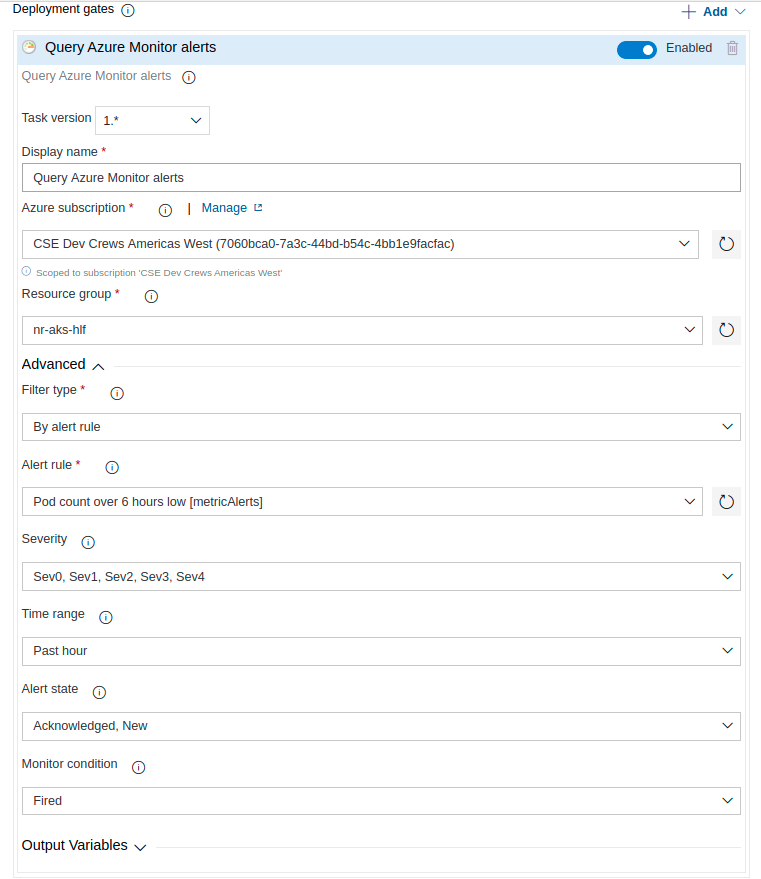
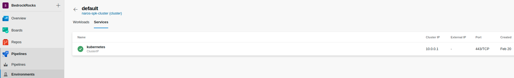
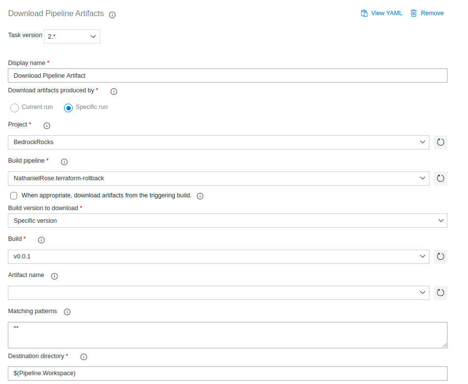
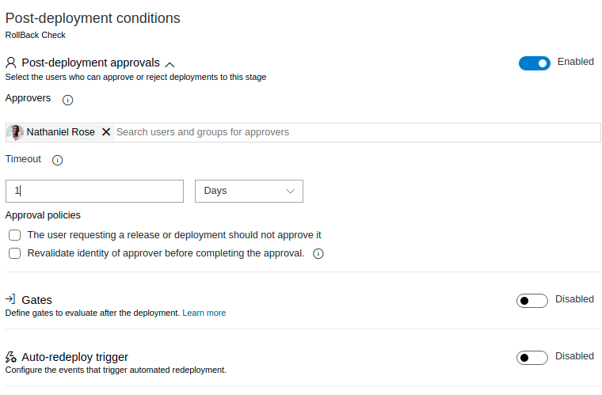

# Terraform Rollback Implementation using Bedrock CLI

| Revision | Date         | Author         | Remarks       |
| -------: | ------------ | -------------- | ------------- |
|      0.1 | Apr-20, 2020 | Nathaniel Rose | Initial Draft |
|      0.1 | May-11, 2020 | Nathaniel Rose | Updated Draft |

## 1. Overview

It is highly desireable to have a fully-automated Continuous Delivery pipeline
in place to assist with testing and validation of source code changes made to
the application services and supporting infrastructure. Without such a system,
it is difficult to have any degree of confidence that a new deployment will
succeed without introducing new regressions. However, high velocity of changes
with distributed teams may eventually lead to the scenario in which a production
environment transitions into a failed state due to an improperly tested feature
added.

This document outlines multiple solutions and approaches that seeks to provide a
rollback mechanisms to ensure the successful deployment of terraform
infrastructure, automated reverted features in a release pipeline, and system
alerting to notify key stakeholders and operations of system activity.

Rolling back services which includes a relational database can be very
difficult. Traditionally this is done by restoring from a backup, performed
prior to the upgrade. A more modern approach is to integrate a database
migration tool into your application's installation procedure.

## 2. Out of Scope

This design document solely covers strategic approaches to revert terraform
changes to a deployed GitOps environment in Azure DevOps after changes made have
caused state failures. This design leverages the use of terraform state files,
Azure storage accounts and commit hashes to build an audit history. It does not
address the following:

- Redeployment of stateful services in your environment
- Complications arise when incompatible changes occur during failed terraform
  apply
- Disaster recovery operability in respective to a fail production environment

## 3. Design Details

Rollback can be triggered in a separate AzDO Pipeline upon failure to build an
Environment stage. Using automation and the release history of a pipeline, an
environment can be reverted to a previous state pending operator approval. This
implementation can be separated into 3 components


- Failure Detection Triggers
- Terraform Backend Rollback
- Evaluating Health success

### 3.1 Overview

#### Remote Backend:

The best way to manage shared storage for state files is to use Terraform’s
built-in support for remote backends. A Terraform backend determines how
Terraform loads and stores state. The remote backend allows you to store the
state file in a remote, shared store. In Azure, this remote backend will be
stored in an Azure storage account. Incoming modifications to the terraform
deployments will be managed using the tfstate file stored as a blob in the
provided storage account. The Lease Blob operation creates and manages a lock on
a blob for write and delete operations.

#### Workspaces:

The persistent data stored in the backend belongs to a workspace. Initially the
backend has only one workspace, called "default". Workspaces can be managed
through CLI within out CD pipeline to represent specific deployment
environments. We can create a workspace to target an environment using
`terraform workspace new <dev_environment>`. This will allow us to select state
files stored in our backend respective to a staging environment.

#### Pipeline Environments:

In Azure DevOps, an environment is a collection of resources that can be
targeted from your pipeline deployments. These Environments can identify the
health status of Azure resources such as web apps, virtual machines and
kubernetes clusters. You are able to use workspaces to associate staging to
target separate deployment environments for Dev, Test, QA, Staging, and
Production.

#### Release Gates:

In the release pipeline we will enable gates at the start of a stage in the
Pre-deployment conditions. This gate allows us to evaluate our environment using
integration points from Azure. We can delay the evaluation so all bugs and
errors are logged then use our gate to do a variety of options such as invoke an
Azure function, query azure monitor alerts, invoke a REST API call, query work
items, or leverage a custom gate from the azure marketplace.

### 3.2 Failure Detection Triggers

Once a failed feature has been merged to our live application and our deployment
state requires a rollback, we can create a new _Release Pipeline_ that is
triggered by the published artifacts used in the build pipeline deployment to
check the environment for a required roll-forward.

> YAML is not supported for release definitions. You are able to output a json
> definition for your release to apply to other projects.
> https://dev.azure.com/mseng/AzureDevOpsRoadmap/_workitems/edit/1221170/

#### Select your Build Pipeline Artifact Trigger

Inside Pipelines navigate to Releases to create a new release pipeline. Here you
will see an option to obtain an artifact from a build pipeline.



Here you will have the option of selecting the DevOps Project, Source build
pipeline, and the default branch version. You also have the option to use an
artifact source from GitHub or TFVC. Once you select your build pipeline we can
configure a continuous deployment trigger to initiate the release pipeline every
time a new build is available. You also have the option to configure a polling
trigger schedule or a pull request trigger to enable the release as part of a
pull request workflow.

#### Configure a Pre-deployment Condition Gate

Create a new pipeline stage with an empty job and name it _Rollback Check_. Once
the stage is created, click the Pre-deployment condition and select the
`after release` trigger as the trigger that will start the deployment to this
stage. Next we will enable Gates and add an arbitrary delay time of 10 minutes
before evaluation to assure\ all are logs have been generated.



Here we can use custom gates to invoke our rollback check including community
available gates provided on the
[Visual Studio marketplace](https://marketplace.visualstudio.com/search?term=tag%3ARelease%20Gates&target=AzureDevOps&category=All%20categories&visibilityQuery=all&sortBy=Relevance).
In this example, we `Query Azure Monitor alerts` to check the status of our AKS
cluster deployed using terraform and Application Insights to assure its in a
healthy state. In my Application Insights, I have an alert that checks the
readiness of my aks pods over an aggregated time.



You're able to define a variety of alerts that target services or databases
using
[Azure Alerts](https://docs.microsoft.com/en-us/azure/azure-monitor/platform/alerts-overview).
In the pre-deployment gate we add the previously configured alert as a
condition.



Finally we can add evaluation options that dictate the time between
re-evaluation of the gate, the timeout after which the gate will fail and also
the approval requirement after the successful gate has been triggered.

### 3.3 Terraform Backend Rollback

With _Azure DevOps Pipeline Environments_, we can monitor Azure Web Apps, and
Kubernetes clusters as resources of deployments. We can also track the health
state of workloads and services within the cluster. Build deployments are
associated with PR git hashes and we can use this to identify a previous healthy
state to roll back our environment to.



Let's navigate back to our _Rollback Check_ stage and add a task to Download
Pipeline Artifacts. Here we can download a previous build artifact that can be
tagged to a specific version. The build version number can be passed in from a
variable group that tracks successful builds of your resources.



Now you have the option to run pre-validation tests to assure the
`terraform apply` will be successful. For simplicity we run `terraform init`,
`plan` in this stage. When configuring the terraform tasks, use your variable
group to pass the values for the `Resource group`, `storage account` and
`Container`. The `terraform plan output` will be the previous terraform state
binary from the prior build artifact. Below is an example of a task YAML:

```
- script: |
              . build.sh --source-only
              init
              cd $PROJECT_DIRECTORY-generated/$CLUSTER
              terraform apply "$artifactsBuild/prod-tfplan"
            env:
              ARM_CLIENT_ID: $(ARM_CLIENT_ID)
              ARM_CLIENT_SECRET: $(ARM_CLIENT_SECRET)
              ARM_TENANT_ID: $(ARM_TENANT_ID)
              ARM_SUBSCRIPTION_ID: $(ARM_SUBSCRIPTION_ID)
            displayName: 'Terraform apply'
```

#### Configure a Post-deployment Condition Approval

Finally we configure a post-deployment approval that selects a user who can
approve or reject deployments between our Rollback Check stage and Rollback
Apply. This allows a human in the loop prior to our automation deploying to our
environment.



## 4. Dependencies

This design for a Rollback Terraform Deployments will leverage the following:

- [Bedrock Infra Deployment Pipeline](../../guides/infra/bedrock-infra-generation-pipeline.md)
- [Bedrock Pre-Reqs: az cli | terraform | golang | fabrikate ](https://github.com/microsoft/bedrock/tree/master/tools/prereqs)
- [Azure DevOps Environments](https://docs.microsoft.com/en-us/azure/devops/pipelines/process/environments?view=azure-devops)
- [Terraform](https://github.com/hashicorp/terraform)
- [Release Gates](https://docs.microsoft.com/en-us/azure/devops/pipelines/release/approvals/gates?view=azure-devops)

**Risks & Limitations:**

- Redeployment of stateful services in your environment are not accounted for in
  this guide.
- Complications arise when incompatible database changes during failed apply
- Disaster recovery operability in respective to a fail production environment

Components of this design are based on the learnings from:

- [Microsoft Bedrock Kubernetes Workflow Project](https://github.com/microsoft/bedrock)
- [Bedrock-CLI Infrastructure Generation Pipeline](https://github.com/microsoft/bedrock-cli/blob/master/guides/infra/spk-infra-generation-pipeline.md)
- [Terraform Recommended Practices](https://www.terraform.io/docs/cloud/guides/recommended-practices/)
