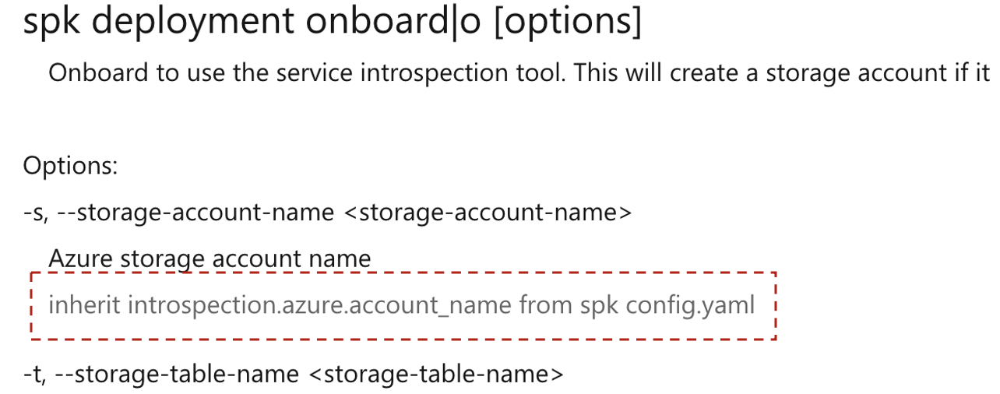

# Software Design Document

Reference: Simplification of command option values inheriting configuration
values from spk config yaml command<br> Authors: Andre Briggs, Dennis Seah

| Revision | Date         | Author      | Remarks                                                 |
| -------: | ------------ | ----------- | ------------------------------------------------------- |
|      0.1 | Mar-28, 2020 | Dennis Seah | Initial Draft                                           |
|      1.0 | Mar-31, 2020 | Dennis Seah | Set revision as 1.0, doc is presented in review meeting |

## 1. Overview

By Design, `spk` command option values inherit from configuration values from
spk config yaml. This is to help the user from having to provide these values in
the command line. However, in our generate documents and `commander` generated
help, users are not informed about these inheritance. In this design doc, we
propose a way to add this inheritance information in our generated operation
document; and also a helper function to automatically populate values from
`config.yaml` to the command option values.

## 2. Out of Scope

This design shall only target making user experience better by providing
inheritance information in operation help document; and the helper function to
populate values from `config.yaml` to the command option values. It will
succinct explain how this function works.

## 3. Design Details

### 3.1 New property in command json file.

Taking this option from `spk deployment onboard` command for example.

```
  "options": [
    {
      "arg": "-s, --storage-account-name <storage-account-name>",
      "description": "Azure storage account name",
      "required": true
    },
```

We introduce a new optional property `inherit`

```
  "options": [
    {
      "arg": "-s, --storage-account-name <storage-account-name>",
      "description": "Azure storage account name",
      "inherit": "introspection.azure.account_name",
      "required": true
    },
```

With this new property, we have the opportunities to

1. add inheritance information in operation help document;
1. create helper function to populate values from `config.yaml` to the command
   option values.
1. developers can have a clear understand of what values in `config.yaml` are
   inherited in which commands.

### 3.2 Add inheritance information in operation help document

In the
[spk.js](https://github.com/CatalystCode/spk/blob/master/docs/commands/spk.js)
javascript, we can add code to insert inheritance information like this.

<p style="text-align:center">

</p>

### 3.3 Helper function to populate values from config.yaml

the pseudo code is like this

```
interface ConfigValues {
  [key:string]: string | ConfigValues | undefined
}

interface CommandValues {
  [key:string]: string | undefined
}

export const populateInheritValueFromConfig = (
  options: CommandOption[], # from json decorator
  config: ConfigValues,     # from config.yaml
  values: CommandValues     # user input
): void => {
  if [config && options] # do nothing if these are absent
    get options that have inherit property set
    for each of these options
      if values do not contain value for the option
        find the value in config and set it to values object
  }
};
```

## 4. Dependencies

None

## 5. Risks & Mitigation

None

## 6. Documentation

Document how to add `inherit` property in json file in our developer guide.

\- end -
