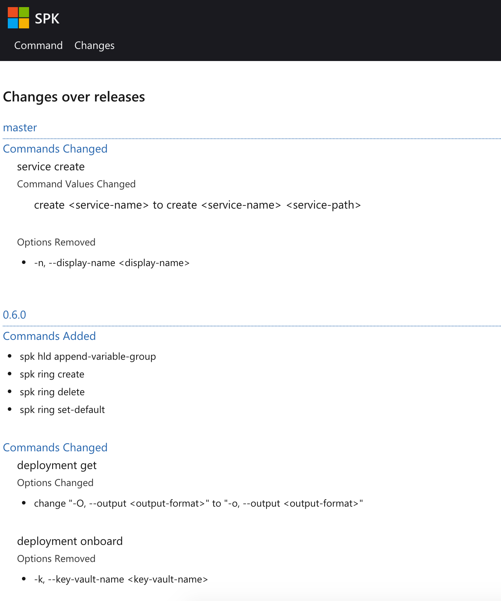

# Software Design Document

Reference: Operational Document for command changes over releases<br> Authors:
Andre Briggs, Dennis Seah

| Revision | Date         | Author      | Remarks                            |
| -------: | ------------ | ----------- | ---------------------------------- |
|      0.1 | Apr-05, 2020 | Dennis Seah | Initial Draft                      |
|      1.0 | Apr-07, 2020 | Dennis Seah | Bump revision up 1.0 after review. |

## 1. Overview

We have a set of document for each command at
https://microsoft.github.io/bedrock-cli/commands. Our users/customers can use
this as a reference for all commands supported in each release. They also need
to know the changes in between releases so that they adapt to these changes (if
needed) accordingly. They can eye-ball for the changes by comparing the document
between releases; and it is tedious. In this document, we discuss how to
generate document to show changes between releases.

## 2. Out of Scope

This design shall only target making user experience better by providing
information on changes in commands between releases based on the artifacts that
we generated for each releases. that's all the `data*.json` files in
https://github.com/microsoft/bedrock-cli/tree/master/docs/commands

## 3. Design Details

### 3.1 Data set

We have a `txt` file that contains all the release numbers and master branch.
https://github.com/microsoft/bedrock-cli/blob/master/docs/commands/releases.txt.
We know the releases to compare by sorting them in descending order. e.g.

```
master
0.6.0
0.5.8
0.5.7
0.5.6
0.5.5
```

That's comparing `master` with `0.6.0` release, `0.6.0` release with `0.5.8`
release, etc.

### 3.2 Comparing releases

We compare two json files for

1. new commands - commands that are in the current and not in previous release.
1. dropped commands - commands that are in the previous and not in current
   release.
1. changes in commands
   1. new options - options that are added in current release
   1. dropped options - options that are removed in current release
   1. changed options - options that are changed in current release. for this
      design, we only consider change in option alias e.g. `-O --output` to
      `-o --output`.

### 3.3 Sample Screenshot

<p style="text-align:center">

</p>

## 4. Dependencies

None

## 5. Risks & Mitigation

None

## 6. Documentation

None

\- end -
