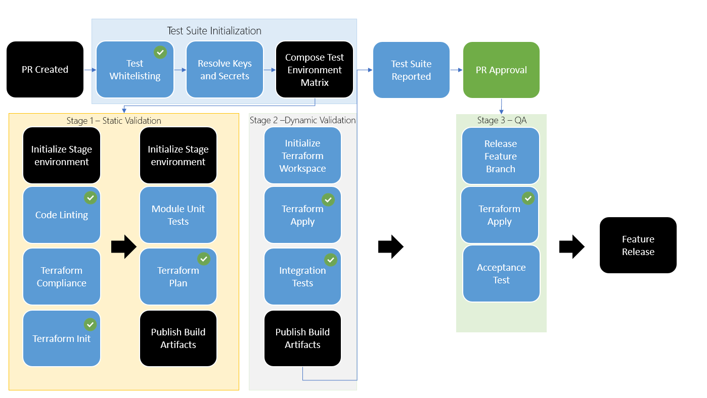

# MSI Support Testing for Bedrock AKS-gitops

| Revision | Date         | Author         | Remarks                          |
| -------: | ------------ | -------------- | -------------------------------- |
|      0.1 | Mar-30, 2020 | Nathaniel Rose | Initial Draft                    |
|      0.2 | Apr-16, 2020 | Nathaniel Rose | Added Appendix                   |
|      0.3 | Apr-20, 2020 | Nathaniel Rose | Added Terratest Abstraction repo |

## 1. Overview

Managed Identities for Azure resources provides Azure services with an
automatically managed identity in Azure AD. You can use the identity to
authenticate to any service that supports Azure AD authentication, including Key
Vault, without any credentials in your code. Terraform can be configured to use
managed identity for authentication in one of two ways: using environment
variables, or by defining the fields within the provider block.

AKS creates two managed identities:

- System-assigned managed identity: The identity that the Kubernetes cloud
  provider uses to create Azure resources on behalf of the user.

- User-assigned managed identity: The identity that's used for authorization in
  the cluster.

This document outlines a testing suite to support feature related support for
managed identities in AKS using a proposed new Bedrock environment that
leverages a modified Terratest Abstraction test harness in order for test pod
identity within an AKS cluster using agile CI/CD and test validation.

### Scenarios Addressed:

1. [As an SRE, I want Enable MSI Support for aks-gitops module](https://github.com/microsoft/bedrock/issues/994)
2. [As an Operator, I want automated testing validation for MSI verified within Bedrock](https://github.com/microsoft/bedrock/issues/1197)
3. [As an operator, I want integration Tests tracking with junit logs from terratest](https://github.com/microsoft/bedrock/issues/867)
4. [As an operator, I want to implement a managed service identity (via AAD Pod Identity) based secret handling strategy](https://github.com/microsoft/bedrock/issues/482)

## 2. Out of Scope

An existing pull request for Bedrock currently exists that enables MSI support
for aks-gitops modules [#995](https://github.com/microsoft/bedrock/pull/995).
This design document seeks to solely capture a terraform template and
complementary test.

The following are not included in this proposal:

- Mocking for Terraform Unit Tests
- Feature revert and Rollback from failed merges
- Adjusting Terratest Abstraction Test Fixture support for current file
  organization of Bedrock: i.e.: testing files in respective folders for
  template environments.

## 3. Design Details

This design seeks to introduce modular testing for terraform known as
`Test Fixtures` based on best practices initially introduced by
[Terratest Abstraction](https://github.com/microsoft/terratest-abstraction). The
test fixtures decouples terraform commands to respective pipeline templates to
be called and dynamically populated by a targeted template test.

### 3.1 Embed new Infrastructure DevOps Model Flow - Continuous Integration

Bedrock infrastructure integration tests have problematic gaps that do not
account for terraform unit testing, state validation to live environments and
staged release management for Bedrock versioning. Bedrock test harness does not
contain module targeted fail fast resource definition validation outside the
scope of an environment `terraform plan`. In addition, integration tests are
validated through new deployments that require extensive time to provision.
Furthermore, releases of features contain no issue reporting benchmark,
automated deployment validation, or guidance process for merging into master. In
this design we wish to provide a single template leveraging MSI that verifies a
new Infrastructure Testing Workflow that improves on the current Bedrock test
harness.

This design is intended to address expected core testing functionality
including:

- Support deployment of application-hosting infrastructure that will eventually
  house the actual application service components capture basic metrics and
  telemetry from the deployment process for monitoring of ongoing pipeline
  performance and diagnosis of any deployment failures
- Support deployment into multiple staging environments
- Execute automated unit-level and integration-level tests against the
  resources, prior to deployment into any long-living environments
- Provide a manual approval process to gate deployment into long-living
  environments
- Provide detection, abort, and reporting of deployment status when a failure
  occurs.



The proposed new Infrastructure Devops Flow for Terraform Testing can be
separated by 4 key steps:

1. Test Suite Initialization - Provisioning global artifacts, secrets and
   dependencies needed for targeted whitelisted test matrix.
2. Static Validation - Environment initialization, code validation, inspection,
   terraform security compliance, and terraform module unit tests.
3. Dynamic Validation - Targeted environment interoperability, integration
   tests, cloud deployment, de-provisioning of resources, error reporting.
4. QA- Peer approval, release management, feature staging, acceptance test
   within live cluster.

> The diagram above contains green check marks that indicate preexisting Bedrock
> testing components that are already implemented through the current test
> harness.

### 3.2 Creation of Managed Identity enable AKS Gitops Environments

A new AKS Bedrock template with Managed Identity enabled, (`azure-MI`), will be
added to the collection of environment templates. This template will be an
upgraded derivative of the `azure-simple` template, with a new dependency on
`azure-common-infra` and will contain the following:

- Managed Identity System Level for AKS
- Pod Identity Security Policy
- Backend State

**Sample `Main.tf`**

```
resource "azurerm_resource_group" "aks_rg" {
  name     = local.aks_rg_name
  location = local.region
}

module "aks-gitops" {
  source = "github.com/microsoft/bedrock?ref=aks_msi_integration//cluster/azure/aks-gitops"

  acr_enabled              = true
  agent_vm_count           = var.aks_agent_vm_count
  agent_vm_size            = var.aks_agent_vm_size
  cluster_name             = local.aks_cluster_name
  dns_prefix               = local.aks_dns_prefix
  flux_recreate            = var.flux_recreate
  gc_enabled               = true
  msi_enabled              = true
  gitops_ssh_url           = var.gitops_ssh_url
  gitops_ssh_key           = var.gitops_ssh_key_file
  gitops_path              = var.gitops_path
  gitops_poll_interval     = var.gitops_poll_interval
  gitops_label             = var.gitops_label
  gitops_url_branch        = var.gitops_url_branch
  kubernetes_version       = var.kubernetes_version
  resource_group_name      = azurerm_resource_group.aks_rg.name
  service_principal_id     = module.app_management_service_principal.service_principal_application_id
  service_principal_secret = module.app_management_service_principal.service_principal_password
  ssh_public_key           = file(var.ssh_public_key_file)
  vnet_subnet_id           = module.vnet.vnet_subnet_ids[0]
  network_plugin           = var.network_plugin
  network_policy           = var.network_policy
  oms_agent_enabled        = var.oms_agent_enabled
}
```

Questions & Limitations:

- With the deployment of the `azure-common-infra` template for Key Vault, will
  that also need to be modified for Manage Identity to whitelist AKS to access
  keyvault?

### 3.3 Testing for Managed Identity enable AKS Gitops Environments

The testing for the Managed Identity enabled AKS gitops environment will
incorporate the aforementioned new Infrastructure DevOps Model Flow for
Terraform to assess pod identity access for a Voting App service deployed using
terraform and a flux manifest repository.

#### Unit Tests

Terratest Abstraction Test Fixtures includes a library that simplifies writing
unit terraform tests against templates. It extracts out pieces of this process
and provides a static validation for a json sample output per module. For this,
we require Unit Tests for the following modules:

- AKS
- Key Vault
- VNet
- Subnet
- Gitops

#### Integration Tests

Integration tests will validate resource interoperability upon deployment.
Pending a successful `terraform apply`, using a go script and terratest go
library, this design will create an integration test for the respective
environment template that verifies

- Access to cluster through MI
- Flux namespace
- Access to voting app using Pod Identity
- Access to key using flex-volume
  ([Unable to use Env Vars](https://github.com/Azure/kubernetes-keyvault-flexvol/issues/28))
- 200 response on Voting App

#### Acceptance Test

Acceptance tests are defined in this design as a system affirmation that the
incoming PR has a successful build in a live staging environment once applied.
Maintain a live QA environment that successful builds from an incoming PR are
applied to the state file.

Questions & Limitations:

- With an incoming change to an azure provider module, how will this be applied
  to an existing terraform deployment. If fail, should we redeploy a new
  `azure-MI` environment for QA?

#### Reporting

Output a test failure report using out-of-box terratest JUnit compiler to
capture errors thrown during build.

The whitelisted integration test for `azure-MI` will include:

> `go test -v -run TestIT_Bedrock_AzureMI_Test -timeout 99999s | tee TestIT_Bedrock_AzureMI_Test.log`

> `terratest_log_parser -testlog TestIT_Bedrock_AzureSimple_Test.log -outputdir single_test_output`

The pipeline will publish the XML report as an artifact that is uniquely named
to AzDO.

```
 task: PublishPipelineArtifact@1
        inputs:
          path: $(modulePath)/test/single_test_output
          artifact: simple_test_logs
        condition: always()
      - task: PublishTestResults@2
        inputs:
          testResultsFormat: 'JUnit'
          testResultsFiles: '**/report.xml'
          searchFolder: $(modulePath)/test
        condition: and(eq(variables['Agent.JobStatus'], 'Succeeded'), endsWith(variables['Agent.JobName'], 'Bedrock_Build_Azure_MI'))
```

## 4. Dependencies

This design for a Managed Identity AKS Testing Harness will leverage the
following:

- [Bedrock Pre-Reqs: az cli | terraform | golang | fabrikate ](https://github.com/microsoft/bedrock/tree/master/tools/prereqs)
- [Terratest](https://github.com/gruntwork-io/terratest)
- [Terraform Compliance](https://github.com/eerkunt/terraform-compliance)
- [Terratest Abstraction Terraform Test Fixtures](https://github.com/microsoft/terratest-abstraction)

## 5. Risks & Mitigations

Risks & Limitations:

- With the deployment of the `azure-common-infra` template for Key Vault, will
  that also need to be modified for Manage Identity to whitelist AKS to access
  keyvault?
- With an incoming change to an azure provider module, how will this be applied
  to an existing terraform deployment. If fail, should we redeploy a new
  `azure-MI` environment for QA?
- How long does it take to deploy MI and Keyvault in a pipeline?

## 6. Documentation

Yes, Documentation will need to be added to the new terraform environment and
the Bedrock testing guidance.

## 7. Appendix

### Feature Comparison

|                               Feature | Bedrock | Terratest Abstraction |
| ------------------------------------: | ------- | --------------------- |
|                     Test Whitelisting | Yes     | Yes                   |
|                Resolve Keys & Secrets | No      | Yes                   |
|               Staged Test Environment | Yes     | Yes                   |
|                          Code Linting | Yes     | Yes                   |
|                  Terraform Compliance | No      | No                    |
| Terraform Commands: Init, Plan, Apply | Yes     | Yes                   |
|                   Module Unit Testing | No      | Yes                   |
|                   Integration Testing | Yes     | Yes                   |
|          Automated Release Management | No      | No                    |
|                    Acceptance Testing | No      | No                    |

1.  **Test Whitelisting** - Using `git diff` to determine which files have been
    modified in an incoming PR to target the appropriate tests that need to be
    ran successfully respective to the files changed.
2.  **Resolve Keys & Secrets** - Using Azure Key Vault to successfully populate
    values through a variable group to be used as environment arguments for
    infrastructure or service layer turnstiles.
3.  **Staged Test Environments** - Separate collections of resources targeted by
    the whitelisted results of the deployment pipeline. These environments are
    configured for validating tests at different stages of the test pipeline.
4.  **Code Linting** - Analyze source code for error, bugs and stylistic
    inconsistencies for golang, terraform and other languages leveraged. This
    will ideally be migrated to ore-commit git hooks that format source code
    prior to a `git push`.
5.  **Terraform Compliance (Optional)** - Use negative testing to validate a
    parsed output of `terraform plan` provides values that are acceptable for
    deployment according to a predefined encrypted configuration set for
    resources.
6.  **Terraform Commands** - Dissociated, decoupled terraform commands for
    initializing, planning and applying incoming changes at different stages in
    the test pipeline. Currently terraform commands are carried out in the
    terratest go scripts for integration tests. The commands need to be migrated
    to their own respective pipeline step for improved visibility of deployment
    failures.
7.  **Module Unit Testing** - Run `terraform init`,
    `terraform workspace select`, `terraform plan` and parse the plan output
    into a Terraform Plan to validate a resource attribute matches a provided
    value mapping for the terraform module.
8.  **Integration Testing** - Use the Go library
    [terratest](https://github.com/gruntwork-io/terratest) to run automated
    infrastructure integration tests that check health of deployed resource such
    as Kubernetes services, web server http responses, database mock values,
    agent logs.
9.  **Automated Release Management** - Use continuous delivery inside the DevOps
    pipeline to carry incoming features through staged production environments
    and landing a incremental release branch. This allows Master branch to
    always remain ready and successful.
10. **Acceptance Testing (Optional)** - Documentation or boiler plate example of
    an acceptability test for infrastructure in release pipeline to evaluate
    system compliance, performance or business requirements.
