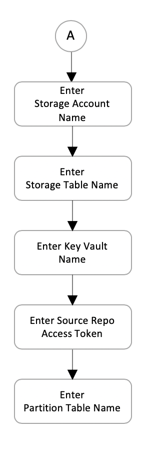

# Software Design Document

Reference: spk init interactive mode - supporting introspection configuration

<p>
Authors:

- Samiya Akhtar, samiya.akhtar@microsoft.com
- Andre Briggs, andre.briggs@microsoft.com
- Dennis Seah, dennis.seah@microsoft.com
  </p>

---

| Revision | Date         | Author      | Remarks                           |
| -------: | ------------ | ----------- | --------------------------------- |
|      0.1 | Mar-16, 2020 | Dennis Seah | Initial Draft                     |
|      0.2 | Mar-17, 2020 | Dennis Seah | Having key vault name as optional |

## 1. Overview

Our objective is to improve the usability of `spk init` command. We have already
added very basic support for prompting organization name, project name and
personal access token; and writing them into `spk` `config.yaml` file.

We hope to extend this effort to cover the basic setup for introspection
configuration values. We shall prompt for the values and validate them
accordingly.

Setting up introspection configuration values shall be optional. User can choose
to skip it.

<p style="text-align:center">

</p>

## 2. Out of Scope

This design shall only consider the case wher user already has Azure storage
account and table setup. That's service principal's information and subscription
identifier are not needed in this scenario.

## 3. Design Details

<p style="text-align:center">

</p>

User needs to provide these information

1. Storage Account Name
   - Lowercase letters and numbers are allowed;
   - 3 to 24 characters long
1. Storage Table Name
   - Alphanumeric and start with an alphabet;
   - 3 to 63 characters long
1. Key Vault Name (optional)
   - Alphanumerics and hyphens.
   - Start with letter. End with letter or digit. Can't contain consecutive
     hyphens.
   - 3 to 24 characters long
1. Source Repo Access Token (Secret)
   - cannot be empty string
1. Partition Table Name
   - cannot be empty string

Note:

> The command line tool will read these values from existing `spk` `config.yaml`
> (if this file exists) and have the values in `config.yaml` as default value
> for each prompt. E.g. you have `my-secret` as Storage Account Key, you will
> have a prompt like this.

```
? Enter Storage Account Key
(my-secret)
```

You can hit enter key to accept the default value or enter a new value.

Note:

> `spk` `config.yaml` shall not be created if any of the values are invalid.

## 4. Dependencies

None.

## 5. Risks & Mitigations

The content in `spk` `config.yaml` in the `<user-home>/.spk` folder shall be
overwritten. User may lost important information.

## 6. Documentation

Documentation shall be in the `.md` file of the command.

\- end -
