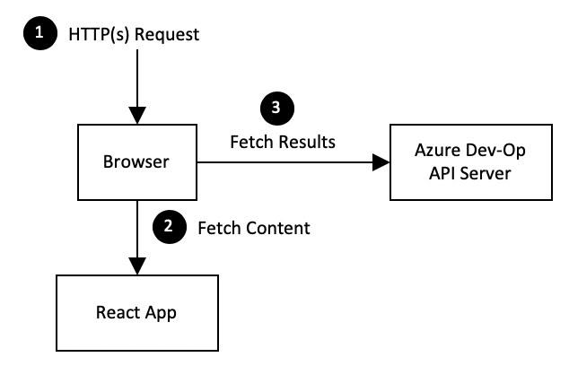
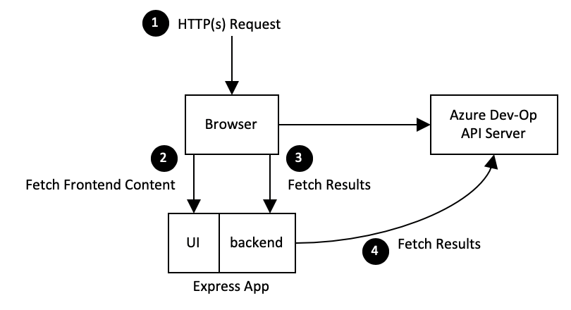
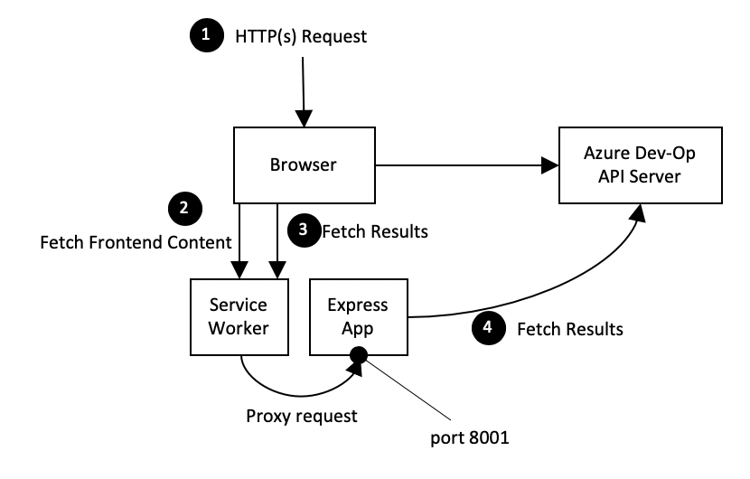

# Software Design Document

Reference: Introspection - Development and production setup of Dashboard <br>
Authors: Samiya Akhtar, Andre Briggs, Dennis Seah

| Revision | Date         | Author      | Remarks                                               |
| -------: | ------------ | ----------- | ----------------------------------------------------- |
|      0.1 | Mar-02, 2020 | Dennis Seah | Initial Draft                                         |
|      0.2 | Mar-05, 2020 | Dennis Seah | Incorporate comments from Andre Briggs                |
|      1.0 | Mar-06, 2020 | Dennis Seah | Void Document section because tasks are taken care of |

## 1. Overview

This design fixes a few things in the previous implementation of
`bedrock deployment dashboard` command. The issues are

1. Secret and configuration values are exposed in the browser.
2. Cross-origin resource sharing, CORS issue because HTTP request is initiated
   from browser to Azure DevOps API Server.

These problems are due to how the React App was deployed.

<p style="text-align:center">

</p>

The React App had only a frontend layer hence secret and configuration values
need to be sent to the browser so that browser can make HTTP calls to Azure
Dev-Op API server (which leads to CORS error).

## 2. Out of Scope

This design shall only address the above mentioned issues, see
[Background Section](#background). There a few other known issues, see
[Known issues](#known-issues) section; and they shall be addressed in a separate
software design document.

## 3. Design Details

We introduced a backend layer to address the above mentioned issues and the
landscape looks like this.

<p style="text-align:center">

</p>

1. Secret and configuration values need not be sent to the browser because the
   backend is making the Azure Dev-Op API calls.
2. We do not have CORS issue because these HTTP calls are made from the backend.

### 3.1 Building and Running the Express App

The frontend and backend are hosted by an Express app. This is how this
application is built in the workspace.

1. Building react frontend app `react-scripts-ts build`
2. Building backend app `tsc src/backend/** --outDir build/backend/`
3. Building Express app `tsc src/server.ts --outDir build/`

All the resources and code for the Express app is in the build folder; and the
app runs from the folder. All backend calls are prefixed with `api/`.

Secret and configuration values are exposed to the Express app via environment
parameters.

### 3.2 Running React Service Worker

<p style="text-align:center">

</p>

In order to faciliate code development (mainly in frontend), the react's worker
service is used. And it proxies all requests with `api/` prefix to an Express
application running at port 8001. This proxy is enabled by React's service
worker. We need a value

```
"http://localhost:8001"
```

in `package.json`.

Similarly, secret and configuration values are exposed to the Express app via
environment parameters.

## 4. Dependencies

None. All the implementations are within
[spektate](https://github.com/microsoft/spektate).

## 5. Known issues

### 5.1 Too many calls to Azure Dev-Op API server.

Every call from the frontend to the backend layer shall result in a call to the
Azure Dev-Op API server. This can be a huge overhead and this can be resolved by
having a caching mechanism in the backend.

### 5.2 Multiple HTTP calls from frontend to backend API

The frontend layer is making multiple HTTP calls to the backend in order to
render a complete view. For instance, one call to get deployments; other call to
get author for each deployment; etc. This result in poor user experience.

### 5.3 Access Control of Dashboard

Once the dashboard is deployed in kubernetes or docker swarm, anyone who has
access to the IP address and port is able to see the content of the dashboard.

## 6. Risks & Mitigations

None

## 7. Documentation

All documentation are covered as sprint tasks

## A. Appendix

### A.1 References

1. https://daveceddia.com/create-react-app-express-backend/
2. https://daveceddia.com/deploy-react-express-app-heroku/
3. https://docs.docker.com/engine/reference/commandline/run/

\- end -
