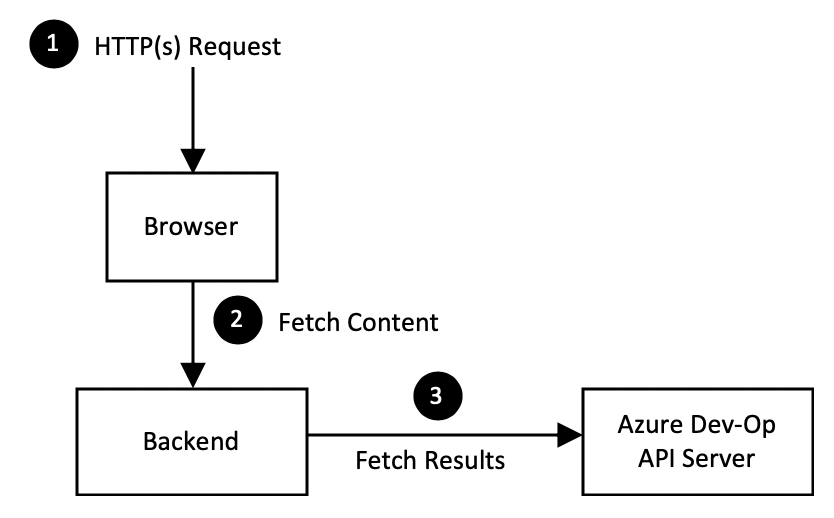
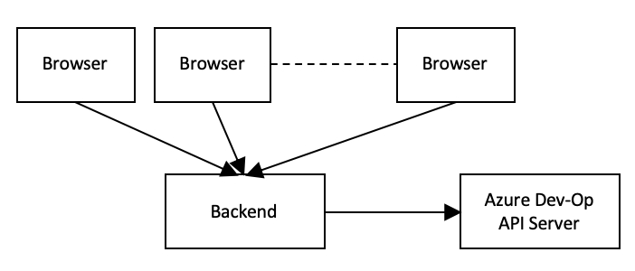

# Software Design Document

Reference: Introspection - Caching of deployment status in Dashboard's backend
  Authors: Samiya Akhtar, Andre Briggs, Dennis Seah

| Revision | Date         | Author        | Remarks              |
| -------: | ------------ | ------------- | -------------------- |
|      0.1 | Mar-07, 2020 | Dennis Seah   | Initial Draft        |
|      0.2 | Apr-23, 2020 | Samiya Akhtar | Caching update logic |

## 1. Overview

The application server that hosts the introspection dashboard has two components
namely the frontend and backend components. The former is representation layer
and the latter is responsible for fetching results from Azure Dev-Op API server.

The frontend has a polling mechanism to fetch the latest result from the backend
(which in turn makes HTTPS call to Azure Dev-Op API server). This can be
problematic when we have multiple browser instances polling for latest results.

1. Too many calls to Azure Dev-Op API server
2. Backend becomes the bottleneck
3. Hitting the limit of API calls to Azure Dev-Op API server
4. User experience is not good because of the tardiness in getting results from
   backend service.

On top of these, the frontend is not doing smart caching. E.g.

1. Fetch the list of deployed instances.
2. For each deployed instances, fetch author information.
3. For each deployed instances, fetch PR information.

There will be _N_ numbers of fetch author API calls to the backend (and then to
Azure Dev-Op API server) if there are _N_ deployment instances.

A better way is to cache the author and PR information and reuse them
accordingly. This will significantly reduce the number of fetch information HTTP
calls.

## 2. Out of Scope

This design shall only address the above mentioned issues. That's

> How to significantly reduce the number of HTTPS calls to Azure Dev-Op API
> server, independent of the number of browsers that consume the backend.

## 3. Design Details

### 3.1 Caching in the backend

The backend shall make these calls to Azure Dev-Ops API Server

1. get the deployed instances
2. get the author information
3. get Manifest Repo Sync State
4. get up-to-date PR information

If there are _N_ deployed instances. There will be

1. one API call to get the deployed instances
2. _N_ API calls to get author information for each instance
3. _N_ API calls to get PR information for each instance
4. one API call to get Manifest Repo Sync State.

So we are looking at <i>2N + 2</i> calls after the backend component is up and
running. And this information is cached.

A timer wakes up at _T_ seconds to refresh the cache in the following manner.

1. one API call to get the deployed instances
2. Check if there are new instances, if yes, make get author information API
   call for these new instances and update the cache.
3. Check if there are deleted deployed instances, if yes, remove them from the
   cache.
4. Check if there are new or updated instances, and if yes, one API call to get 
   Manifest Repo Sync State
5. Check if the instances in cache require an update, this could be any of the
   following scenarios:
   - A deployment was in progress and one of its builds have completed, so the
     status needs to be changed.
   - A deployment was awaiting PR approval and as soon as that is approved, the
     deployment needs to be updated in cache.
   - The last updated time of an instance in cache could be older than the last
     update timestamp of a deployment newly fetched, in which case it needs to
     be updated.

There shall be one call from the frontend (browser) to backend to get the
deployment result, this will include the author and PR result within the
response.

Cache refresh duration, _T_ is customizable via an environment parameter,
`REACT_APP_CACHE_REFRESH_IN_SEC`. During development of React UI, the value of
this parameter can be set to a very high value to avoid hit the Azure Dev-Ops
API.

## 4. Dependencies

None. All the implementations are within
[spektate](https://github.com/microsoft/spektate).

## 5. Risks & Mitigations

### 5.1 Cache Size

The assumption is that the number of deployed instances, _N_ is not large. _N_
is in hundreds and not in thousands. Otherwise, we have to increase the _RAM_
(heap size) for the express app.

## 6. Documentation

How to change the refresh duration: Check the deployment environment variables
passed in through the docker image or helm chart, and add a variable
`REACT_APP_CACHE_REFRESH_IN_SEC` set it to let's say `60` for a 60 seconds
refresh interval.

\- end -
