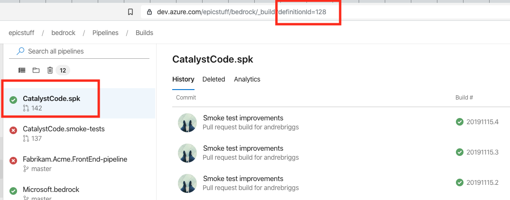

# Integration Testing SPK

This directory contains shell scripts that execute on a build agent and run
`spk` commands. An [Azure DevOps pipeline yaml](../smoke-test-pipeline.yml) file
scheduled the run of these tests. The yaml file orchestrates the download the
lastest master branch build artifact of `spk` on a daily basis and running smoke
tests.

`validations.sh`

- This file orchestrates the scenarios and is designed to fail on first error.

`functions.sh`

- This file has simple functions that are reused by `validations.sh`.

`infra-validations.sh`

- This file orchestrates infrastructure scenarios and is designed to fail on
  first error.

# Scenarios Exercised So Far

- As a developer create a mono-repo and add services
- As a developer create variable group with variables
- As a developer create a pipeline from an existing service
- As a developer create a service revision from an existing service
- As a developer create an HLD of a terraform template for infra deployment.

# Operational Coverage

## Initialization

| Command  | Coverage |
| -------- | -------- |
| spk init | 🚫       |

## Project Creation

| Command                                | Coverage |
| -------------------------------------- | -------- |
| spk project init                       | ✅       |
| spk project create-variable-group      | ✅       |
| spk project install-lifecycle-pipeline | ✅       |

## Service Management

| Command                            | Coverage |
| ---------------------------------- | -------- |
| spk service create                 | ✅       |
| spk service install-build-pipeline | ✅       |
| spk service create-revision        | ✅       |

## HLD Management

| Command                           | Coverage |
| --------------------------------- | -------- |
| spk hld init                      | ✅       |
| spk hld install-manifest-pipeline | ✅       |

## Ingress Route Management

| Command                  | Coverage |
| ------------------------ | -------- |
| spk ingress-route create | 🚫       |

## Variable Group Management

| Command                   | Coverage |
| ------------------------- | -------- |
| spk variable-group create | 🚫       |

## Service Introspection

| Command                  | Coverage |
| ------------------------ | -------- |
| spk deployment get       | 🚫       |
| spk deployment onboard   | 🚫       |
| spk deployment validate  | 🚫       |
| spk deployment dashboard | 🚫       |
| spk deployment create    | 🚫       |

## Infrastructure Management

| Command            | Coverage |
| ------------------ | -------- |
| spk infra scaffold | ✅       |
| spk infra generate | ✅       |

# Setup Instructions

If you wish to run these tests locally, skip ahead to
[Testing locally](#Testing-locally)

## Requirements

1. Azure DevOps Organization and Project
2. Create variable group named `spk-vg`. Inside the variable group have the
   following key/values:

   - AZDO_PROJECT (e.g. `bedrock`)
   - AZDO_ORG (e.g. `epicstuff`)
   - AZDO_PAT (e.g. Personal Access Token with **read/write/manage** access to
     AZDO_PROJECT) <-- 🔒
   - SP_APP_ID (e.g Service Principal App Id)
   - SP_PASS (e.g Service Principal Password) <-- 🔒
   - SP_TENANT (e.g Service Principal Tenant Id)
   - ACR_NAME (e.g Name of ACR resource that is accessible from above service
     principal)
   - SPK_LOCATION - The full path to the spk executable file respectively to the
     OS.
   - SPK_DEFINITION_ID ( DefinitionId of the SPK artifact build)
   - SPK_PROJECT_ID ( Project Id of the AzDO project the SPK build occurs in)
   - FUNC_SCRIPT (e.g.
     https://raw.githubusercontent.com/MY_ORG/spk/master/tests/functions.sh)
   - TEST_SCRIPT (e.g.
     https://raw.githubusercontent.com/MY_ORG/spk/master/tests/validations.sh)
   - TEST_SCRIPT2 (e.g.
     https://raw.githubusercontent.com/MY_ORG/spk/master/tests/infra-validations.sh)

3. [Azure CLI with Azure DevOps Extension](https://docs.microsoft.com/en-us/azure/devops/cli/?view=azure-devops)
   - Provided in pipeline yaml
4. SPK Binary
   - Provided in pipeline yaml

## How to find Definition and Project Ids

Navigate to your SPK build pipeline in Azure DevOps. Pay attention to the URL in
the browser. The example below is for the CatalystCode.spk pipeline. The
definition id is 128. 

You can find the project id but navigating tot
`https://dev.azure.com/{organization}/_apis/projects?api-version=5.0-preview.3`
in your web browser. Replace {organization} with the name of your org. You will
get a JSON payload with a array of Azure DevOps projects. Find yours and use the
top level `Id` field as the Project Id.

## Testing locally

When testing locally you don't need to do the above set up since there is no
pipeline. Instead run these steps:

1. Login into AZ CLI
2. Install Azure DevOps Extension
3. Set the following environment variables
   <pre>
   export SPK_LOCATION=<b>REPLACE_ME</b>
   export AZDO_PROJECT=<b>REPLACE_ME</b>
   export AZDO_ORG=<b>REPLACE_ME</b>
   export ACCESS_TOKEN_SECRET=<b>REPLACE_ME</b>
   export ACR_NAME=<b>REPLACE_ME</b>
   export AZURE_DEVOPS_EXT_PAT=<b>REPLACE_ME</b>
   export SP_PASS=<b>REPLACE_ME</b>
   export SP_APP_ID=<b>REPLACE_ME</b>
   export SP_TENANT=<b>REPLACE_ME</b>
   </pre>
4. Navigate to this directory in shell
5. RUN --> `$ sh validations.sh`
6. RUN --> `$ sh infra-validations.sh`
